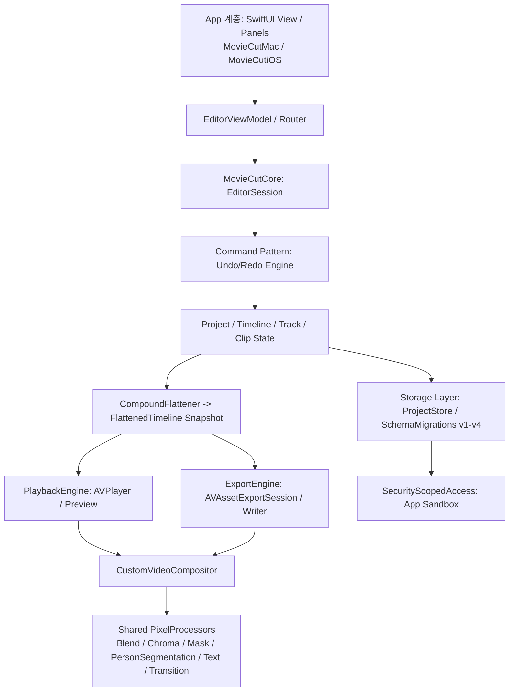

# MovieCut 아키텍처 명세서 (Architecture Specification)

> **버전:** 1.0 (2026-08-15)  
> **대상 플랫폼:** macOS (14.0+), iOS (17.0+)  
> **기술 스택:** Swift 6, SwiftUI, AVFoundation, CoreImage, CoreAudio/AVAudioEngine, Vision

---

## 1. 아키텍처 개요 및 설계 철학

MovieCut은 **"단일 Core 로직, 동일한 Preview/Export 렌더링 결과, 완전한 오프라인 로컬 우선(Local-first)"**을 목표로 하는 고성능 비선형 영상 편집기(NLE)입니다.

### 핵심 설계 원칙
1. **렌더링 파리티 (Rendering Parity)**: 메인 프리뷰(`PlaybackEngine`)와 내보내기(`ExportEngine`)는 완전히 동일한 snapshot(`FlattenedTimeline`)과 공유 픽셀 프로세서(`PixelProcessor`) 파이프라인을 통과합니다.
2. **트랜잭션 기반 단일 변경 (Command Pattern)**: 모든 타임라인 변경 및 프로퍼티 수정은 `EditorSession.dispatch(Command)`를 경유하며, 원자적 Undo/Redo 단위를 보장합니다.
3. **App Sandbox & 보안 북마크 격리**: 파일 I/O는 `SecurityScopedAccess`가 단일 소유하며, 프로젝트 파일은 스키마 버전 체인(v1~v4)을 통해 무손실 로드/마이그레이션됩니다.
4. **로컬 우선 & 제로 네트워크 권한**: 외부 네트워크 통신(`network.client`) entitlement가 0건이며, 모든 AI/DSP(STT, 보컬 분리, 인물 세그멘테이션)는 온디바이스로 처리됩니다.

---

## 2. 계층별 세부 구조

### 2.1 Core 모델 계층 (`Sources/MovieCutCore/Models/`)

* **`Project`**: 프로젝트 최상위 모델. `id`, `name`, `timeline`, `canvas`, `compounds`, `schemaVersion`을 포함합니다.
* **`Timeline`**: 다중 트랙(`[Track]`)과 재생 프레임레이트(`frameRate`), 마커, 오디오 믹스 설정을 소유합니다.
* **`Track`**: 비디오/오디오/텍스트 등의 타입을 가지며, 클립 목록(`[Clip]`)과 잠금/음소거(`isLocked`, `isMuted`) 상태를 가집니다.
* **`Clip`**: 개별 미디어 조각.
  * 시간 매핑: `timelineRange` (타임라인 상 위치/길이) ↔ `sourceRange` (원본 소스 시간)
  * 속성: `speed`, `speedRamp`, `isReversed`, `opacity`, `blendMode`, `zIndex`, `volume`, `fadeInDuration`, `fadeOutDuration`, `isBackgroundRemoved`, `chromaKeySettings`
* **`CompoundDefinition`**: 컴파운드 클립(중첩 시퀀스)을 정의하며, 단일 레벨 Flatten 처리를 위한 자식 클립들을 격리 보관합니다.

### 2.2 명령 및 세션 계층 (`Sources/MovieCutCore/Commands/`)

`EditorSession`은 현재 `Project` 상태와 Undo/Redo 스택을 관리합니다.

* **`Command` 프로토콜**: `apply(to: inout Project) throws -> CommandResult` 및 `invert(from: Project) -> any Command`
* **주요 명령 집합**:
  * `AddClipCommand`, `DeleteClipCommand` (빈틈 유지), `RippleDeleteClipCommand` (빈틈 폐쇄)
  * `SplitClipCommand`, `TrimClipCommand`, `MoveClipCommand`
  * `SlipClipCommand` (sourceRange만 이동), `SlideClipCommand` (timelineRange 및 인접 클립 경계 이동)
  * `SetClipPropertyCommand` (블렌딩 모드, 투명도, 오디오 페이드 등 단일 프로퍼티 변경)
  * `CreateCompoundClipCommand`, `ReleaseCompoundClipCommand`
  * `ImportAndSetClipSourceCommand` (보컬 분리 등 자산 교체와 타임라인 갱신을 단일 undo로 원자 실행)

### 2.3 렌더링 & 합성 파이프라인 (`Sources/MovieCutCore/Rendering/`)

macOS/iOS의 `CustomVideoCompositor`는 프레임 단위로 CoreImage 기반의 공유 프로세서에 합성을 위임합니다.

| 프로세서 | 역할 및 구현 방식 |
|---|---|
| [`BlendPixelProcessor`](file:///Users/cool-mini4/MyDev/automation/movie_cut/Sources/MovieCutCore/Rendering/BlendPixelProcessor.swift) | 12종 블렌딩 모드(Normal, Multiply, Screen, Overlay, Darken, Lighten, ColorDodge, ColorBurn, SoftLight, HardLight, Difference, Exclusion). `.normal`은 무비용 패스스루. |
| [`PersonSegmentationCompositor`](file:///Users/cool-mini4/MyDev/automation/movie_cut/Sources/MovieCutCore/Rendering/PersonSegmentationCompositor.swift) | Vision 프레임워크 기반 온디바이스 인물 마스크 생성 및 배경 제거. 프리뷰는 고속 모드, Export는 정밀 모드. |
| [`ChromaKeyPixelProcessor`](file:///Users/cool-mini4/MyDev/automation/movie_cut/Sources/MovieCutCore/Rendering/ChromaKeyPixelProcessor.swift) | 특정 색상 크로마키 추출, 허용치(Tolerance), 경계 축소(Edge Shrink), 부드러움(Softness) 처리. |
| [`MaskPixelProcessor`](file:///Users/cool-mini4/MyDev/automation/movie_cut/Sources/MovieCutCore/Rendering/MaskPixelProcessor.swift) | 사각형/원형/선형/미러/별/하트 및 브러시 마스크 합성, 반전(Invert) 및 페더(Feather) 지원. |
| [`TextOverlayPixelProcessor`](file:///Users/cool-mini4/MyDev/automation/movie_cut/Sources/MovieCutCore/Rendering/TextOverlayPixelProcessor.swift) | 폰트, 크기, 정렬, 배경 박스, 자막 오버레이 렌더링. |
| [`TransitionPixelProcessor`](file:///Users/cool-mini4/MyDev/automation/movie_cut/Sources/MovieCutCore/Rendering/TransitionPixelProcessor.swift) | 인접 클립 간 12종 Two-source 화면 전환 (Cross Dissolve, Dip to Black/White, Wipe, Slide, Zoom, Glitch 등). |
| [`ColorCorrectionPixelProcessor`](file:///Users/cool-mini4/MyDev/automation/movie_cut/Sources/MovieCutCore/Rendering/ColorCorrectionPixelProcessor.swift) | Brightness, Contrast, Saturation, Exposure, Warmth, Tint, 3-way Lift/Gamma/Gain 및 톤 커브. |

### 2.4 오디오 DSP 파이프라인 (`Sources/MovieCutCore/Audio/`)

* **`VocalSeparationRenderer`**: 센터 채널 위상 상쇄 및 분리 기법을 통해 스테레오 트랙에서 보컬 제거(Remove Vocals) 또는 센터 분리(Isolate Center)를 고속 오프라인 렌더링하여 CAF로 교체.
* **`AudioDuckingPlanner`**: 비디오/보이스오버 트랙의 볼륨을 감지하여 BGM 트랙의 볼륨을 자동으로 낮추는 램프 볼륨 커브 생성.
* **`NoiseReductionService`**: 음성 노이즈 억제 필터링.
* **`BeatDetector`**: 오디오 에너지 분석을 통한 비트 지점 마커 자동 생성.

### 2.5 스토리지 & App Sandbox (`Sources/MovieCutCore/Storage/`)

* **`ProjectStore`**: `.moviecut` 번들/JSON 파일 저장 및 로드.
* **`ProjectSchemaVersioning`**: 스키마 버전 1 → 2(Security Bookmark) → 3(Thermal/Preview) → 4(Blend/Compound) 마이그레이션 체인 보장.
* **`RecentProjectsStore`**: Application Support 디렉토리에 보안 북마크와 메타데이터가 포함된 최근 프로젝트 목록 영속화.
* **`SecurityScopedAccess`**: macOS App Sandbox 환경에서 외부 미디어 파일 접근 권한을 유지하기 위한 Bookmark 생성/해석/Scope 단일 관리자.

---

## 3. 플랫폼별 App 계층 구조

### 3.1 macOS 앱 (`App/MovieCutMac/`)
* **`MovieCutMacApp` / `AppStageRouter`**: 홈 화면(`HomeView`)과 편집기 화면(`ContentView`) 간 라이프사이클 및 저장 확인 제어.
* **`EditorViewModel`**: 뷰 상태, 타임라인 제어, 비디오/오디오 엔진, 인스펙터 선택 상태를 총괄하는 메인 ViewModel.
* **레이아웃 구조**:
  * Top Toolbar (Home, Undo/Redo, Project Name, Preview Quality, Export 버튼)
  * Left: `MediaLibraryPanel` (미디어 자산, 텍스트 프리셋, 오디오 라이브러리)
  * Center: `PreviewPanel` (`AVPlayerView`, Safe Zone 가이드, 실시간 스코프 3종)
  * Right: `InspectorPanel` (Basic, Effects, Audio, Vocal, Text, Subtitles)
  * Bottom: `TimelineView` (다중 트랙 타임라인, 타임라인 툴바, 줌 컨트롤, 룰러)

### 3.2 iOS 앱 (`App/MovieCutiOS/`)
* **`MovieCutiOSApp` / `iOSContentView`**: 모바일/아이패드 환경에 최적화된 적응형 레이아웃.
* **`IOSEditorViewModel`**: Mac ViewModel과 동일한 Core 엔진을 공유하며, 터치 인터랙션과 Bottom Sheet 기반 인스펙터 지원.
* **`IOSCustomVideoCompositor`**: Core의 공유 `PixelProcessor`를 활용하여 동일한 렌더링 결과 보장.

---

## 4. 관측성 및 발열 제어 (Observability & Thermal Management)

* **`OSSignposter` (`AppLog.Signpost`)**: Instruments를 통한 성능 계측:
  * `playback.seek`: 타임라인 탐색 지연
  * `playback.buildComposition`: 프리뷰 합성 빌드 시간
  * `export.preset`: 인코딩 전 구간
  * `import.openProject`: 프로젝트 로드 및 마이그레이션 시간
  * `proxy.generate`: 프록시 생성 시간
* **`ProxyDowngradePolicy` (Thermal Ladder)**:
  * `nominal`: 사용자가 선택한 프리뷰 해상도 유지
  * `fair`: 렌더 해상도를 최대 1/2로 자동 클램프 (프레임 드롭 방지)
  * `serious`: 고화질 미디어를 720p 프록시 미디어로 자동 전환
  * `critical`: 기기 과열 방지를 위해 Export 차단 및 쿨다운 안내
