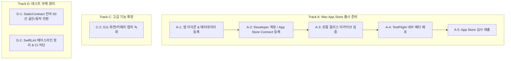

# MovieCut 남은 작업 원장 (Remaining Tasks & Roadmap)

> **버전:** 1.2 (2026-08-15)  
> **기준 빌드:** 통합 게이트 `GATE_PASS` (1,134 Tests PASS, 12/12 Parity Scenarios PASS, Mac/iOS Xcodebuild PASS)  
> **목적:** MovieCut의 릴리스 및 차기 마일스톤 완성을 위한 단일 잔여 작업 원장입니다.  
> **⚠️ 우선순위 상위 문서:** 2026-08-15 외부 검수 채택으로 향후 12개월 우선순위는 [`DEVELOPMENT_DIRECTION_20260815.md`](file:///Users/cool-mini4/MyDev/automation/movie_cut/docs/DEVELOPMENT_DIRECTION_20260815.md)가 최종 결정한다. Track 구조 전체를 4단계 로드맵에 맞춰 재작성하는 것은 해당 문서 §8 후속 작업. 특히 **C-2(화면/카메라 캡처)는 P2로 강등**되었고, 차기 개발 착수 순서는 새 문서 §9를 따른다.

---

## 1. 현재 상태 요약 (완료된 베이스라인)

* **통합 빌드/테스트 게이트**: `swift build` (OK), `swift test` (1,134개 전수 통과), `xcodebuild MovieCutMac` (OK), `xcodebuild MovieCutiOS` (OK) → **`GATE_PASS`**.
* **코어 파이프라인 & 렌더링**: 12개 골든 파리티 시나리오 완주 (MAD ≤ 2.00, 1프레임 지속 오차 이내), Undo/Redo 무결성, 12종 블렌딩, Two-source 전환, 보컬 분리, Slip/Slide 제스처, 스키마 v1~v4, App Sandbox 북마크, 발열 단계 강등 및 Signpost 관측성 확보 완료.
* **iOS 플랫폼 파리티 (Track B 완료)**: `IOSCustomVideoCompositor` 12종 블렌딩 및 2-source 트랜지션 탑재, `IOSExportEngine` 블렌딩 트리거, `Localizable.xcstrings` 다국어 카탈로그 구축 및 빌드 통과.
* **프로 편집 도구 & 컴파운드 클립 Phase 2 (Track C 주요 완료)**:
  - 4대 프로 도구: Selection (V), Blade (C), Slip (Y), Slide (U) 모드 툴바 및 단축키 연동.
  - J/K/L 3점 셔틀 스피드 제어 연동.
  - 컴파운드 클립 Phase 2: 더블클릭 내부 시퀀스 진입, 브레드크럼 네비게이션 (`🎬 Root > 📦 Compound`), 자식 클립 편집 트랜잭션(`UpdateCompoundChildrenCommand`) 및 Undo/Redo 동기화 완료.

---

## 2. 남은 작업 원장 (Remaining Tasks by Track)

---

### 🚀 Track A. Mac App Store 출시 준비 (Release Track)
코드 수준의 빌드/아카이브 자동화 스크립트([`scripts/release.sh`](file:///Users/cool-mini4/MyDev/automation/movie_cut/scripts/release.sh))와 워크플로는 완비되어 있으며, **사용자 설정 및 에셋 등록**이 중심입니다 ([`docs/RELEASE_CHECKLIST.md`](file:///Users/cool-mini4/MyDev/automation/movie_cut/docs/RELEASE_CHECKLIST.md) 참조).

| ID | 작업 항목 | 세부 내용 | 상태 |
|---|---|---|---|
| **A-1** | **S4. 앱 아이콘 에셋 등록** | macOS용 1024×1024 마스터 아이콘 및 `AppIcon.appiconset` 에셋 카탈로그 생성/등록 | ❌ 미착수 |
| **A-2** | **App Store Connect 등록** | `com.moviecut.mac` 앱 생성, Team ID 발급 및 Xcode 계정 연결 | ⚪ 사용자 작업 |
| **A-3** | **로컬 릴리스 아카이브 검증** | `MOVIECUT_TEAM_ID=XXX bash scripts/release.sh` 실행하여 `MovieCutMac.app` 생성 검증 | ⚪ 사용자 대기 |
| **A-4** | **TestFlight 내부 베타 배포** | 내부 테스터(10~20명) 초대 및 [`docs/BETA_GUIDE.md`](file:///Users/cool-mini4/MyDev/automation/movie_cut/docs/BETA_GUIDE.md) 기반 시나리오 검증 | ⚪ 사용자 대기 |
| **A-5** | **App Store 심사 제출** | 1920×1080 프로덕트 스크린샷, 개인정보 처리방침, 앱 설명/키워드 등록 후 최종 심사 요청 | ⚪ 사용자 대기 |

---

### 📱 Track B. iOS 플랫폼 파리티 완성 (iOS Parity Track) - [완료 ✅]

| ID | 작업 항목 | 관련 파일 | 완료 기준 (DoD) | 상태 |
|---|---|---|---|---|
| **B-1** | **Two-source 전환 iOS 배선** | `App/MovieCutiOS/Export/IOSCustomVideoCompositor.swift` | `TransitionPixelProcessor` 경유 전환 렌더링 완료 | ✅ 완료 |
| **B-2** | **12종 블렌딩 모드 iOS 배선** | `App/MovieCutiOS/Export/IOSCustomVideoCompositor.swift`, `IOSExportEngine.swift` | 12종 블렌딩 모드가 `BlendPixelProcessor`를 통해 동일 반영 | ✅ 완료 |
| **B-3** | **iOS 현지화 카탈로그 구축** | `App/MovieCutiOS/Localizable.xcstrings` | iOS UI 텍스트 래핑 및 한국어/영어 카탈로그 동기화 | ✅ 완료 |
| **B-4** | **iOS 통합 빌드 검증** | `MovieCut.xcodeproj` (MovieCutiOS) | `xcodebuild MovieCutiOS` BUILD SUCCEEDED 통과 | ✅ 완료 |

---

### 🛠️ Track C. 고급 기능 확장 (Post-M1 / Inc 2 Backlog)

| ID | 작업 항목 | 관련 파일 | 세부 설명 | 상태 |
|---|---|---|---|---|
| **C-1** | **컴파운드 클립 Phase 2 (내부 편집)** | `App/MovieCutMac/TimelineView.swift`, `EditorViewModel+Compound.swift`, `UpdateCompoundChildrenCommand.swift` | 컴파운드 클립 더블클릭 시 내부 시퀀스 진입/수정하는 중첩 타임라인 UI 및 브레드크럼 내비게이션, Undo/Redo 단일 트랜잭션 동기화 | ✅ 완료 |
| **C-3** | **프로 도구 모드 및 J/K/L 셔틀** | `App/MovieCutMac/TimelineView.swift`, `MovieCutMacApp.swift`, `EditTool.swift` | Select (V), Blade (C), Slip (Y), Slide (U) 전용 도구 모드 툴바 및 J/K/L 셔틀 제어 | ✅ 완료 |
| **C-2** | **S11. 화면/카메라 캡처 입력** | `Sources/MovieCutCore/Media/`, `App/MovieCutMac/Recording/` | `ScreenCaptureKit` 화면 녹화 및 `AVCaptureSession` 웹캠 영상 직접 캡처 패널 | ⏳ 대기 (Inc 3) |

---

### 🧪 Track D. 검증 신뢰도 & 테스트 부채 정리 (Test Debt Track)

| ID | 작업 항목 | 현황 및 목표 | 담당 파일 |
|---|---|---|---|
| **D-1** | **StaticContract 2차 전환 (Batch 2)** | 잔여 50개 파일 중 소스 문자열 검사를 실제 동작 테스트 / 골든 픽셀로 교체 | [`docs/STATIC_CONTRACT_TRIAGE_RESULT.md`](file:///Users/cool-mini4/MyDev/automation/movie_cut/docs/STATIC_CONTRACT_TRIAGE_RESULT.md) 목록 참조 |
| **D-2** | **SwiftLint 베이스라인 정리** | 린트 경고 및 잔여 에러를 해소하고 CI 게이트를 블로킹 모드로 전환 | `.swiftlint.yml`, `scripts/lint_gate.sh` |

---

## 3. 권장 차기 작업 (2026-08-15 개발 방향 확정에 따라 갱신)

> 상세 근거와 실행 순서는 [`DEVELOPMENT_DIRECTION_20260815.md`](file:///Users/cool-mini4/MyDev/automation/movie_cut/docs/DEVELOPMENT_DIRECTION_20260815.md) §9.

1. **[개발] 현재 WIP 커밋 후 1단계 P0 착수**: G-23 전용 크롭 → G-02 Inc5 HSL·톤커브 UI → G-25 AudioRenderGraphSpec 설계. 측정 기반(seek·프로젝트 열기 기준선, 3종 스트레스 타임라인) 선점공.
2. **[개발] lint 신규 error 0 정책 CI 반영 + EditorViewModel 경계 분해 착수** (부채 원칙: 마일스톤 공수 15–20% 고정).
3. **[사용자 진행 추천] Track A (A-1, A-2, A-3)**: 아이콘·App Store Connect 등록은 기능 개발과 병렬 가능. **A-4 TestFlight 베타는 1단계(2026-10)의 "숨겨진 기능 제품화" 완료 후 권장** — 베타 체감 품질이 그때 크게 올라간다.
4. **Track C (C-2) 캡처**: P2로 강등(5개 대표 작업 외. 재검토는 2단계 종료 시점).
