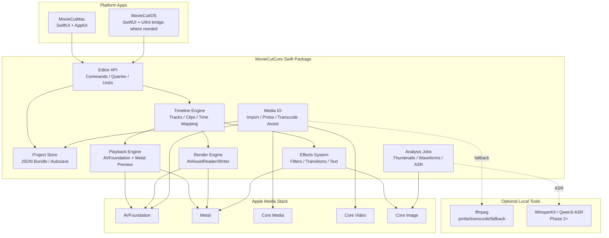
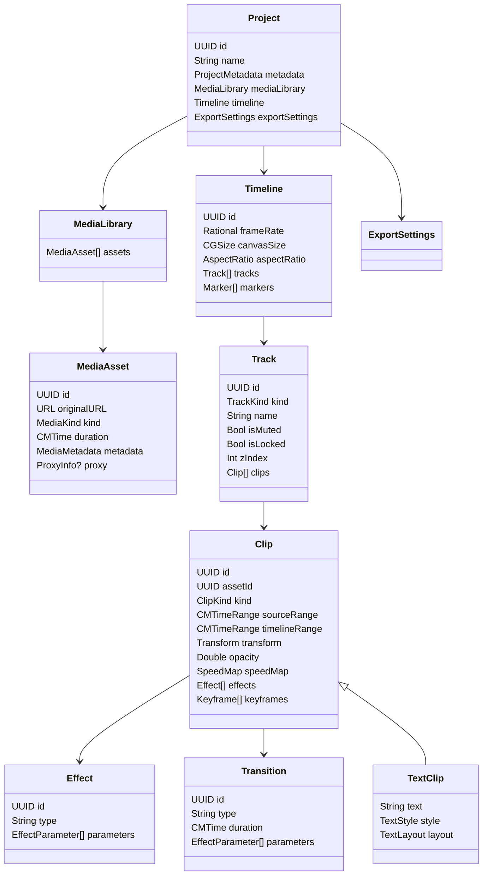
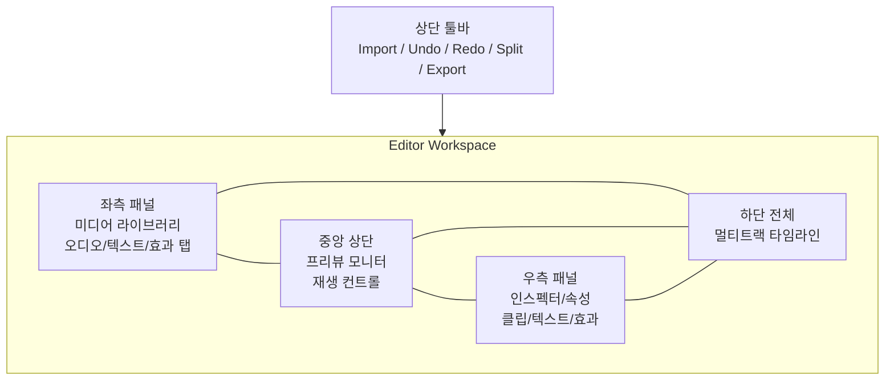
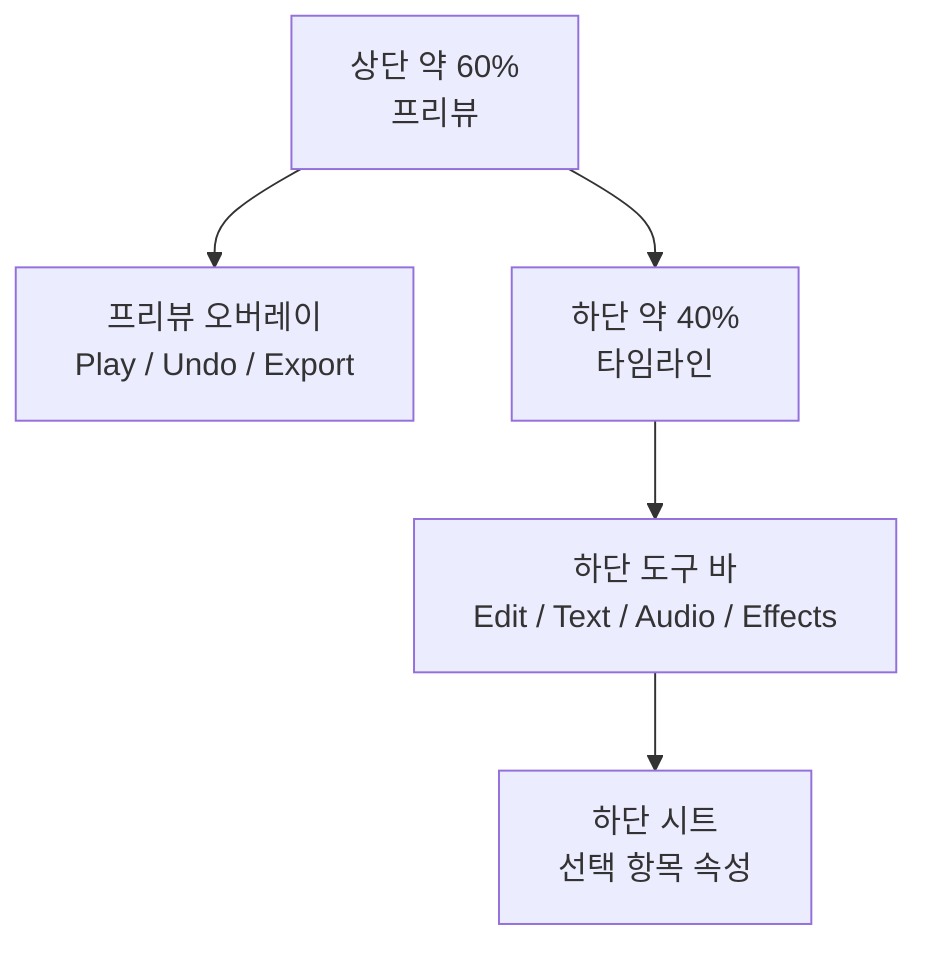

# MovieCut 요구사항 문서

작성일: 2026-06-02 / 최종 갱신: 2026-08-22  
대상: macOS 14.0+, iOS 17.0+  
언어/프레임워크: Swift 6, SwiftUI, AppKit, AVFoundation, Metal, Core Media, Core Video  
프로젝트 성격: **로컬 우선 Pro/프로슈머 비디오 에디터 + 카드뉴스 제작기.** App Store 배포를 목표로 한다.

> **읽는 순서.** §1~§12는 2026-06-02 최초 요구사항이다. 이후 확정된 전략 전환과 감사 결과는 **§13 전략 전환 이후 추가 요구사항**에 모았다.
> §1~§12와 §13이 충돌하면 **§13이 우선한다.** 문서 지도와 열린 작업 원장은 [docs/README.md](README.md).

### 변경 이력

| 날짜 | 변경 |
|---|---|
| 2026-06-02 | 최초 작성. 목표는 "개인용 CapCut 스타일 에디터" |
| 2026-06-22 | **포지셔닝 전환** — 파리티(따라잡기) → **Pro/프로슈머로 CapCut 능가**. §1.5·§13.1 |
| 2026-07-14 | **제품 축 추가** — 카드뉴스 제작(벤치마크: 미리캔버스). §13.5 |
| 2026-07-30 | **App Store 배포를 목표로 승격** — "개인 사용"에서 전환. 출시 차단 요구사항(§13.2), 증거 기반 완료 기준(§13.3), 사용성·성능·Pro 조작·관측성·현지화 요구사항(§13.4·§13.6~§13.10) 신설 |
| 2026-08-15 | **개발 방향 확정(외부 검수 채택)** — 포지셔닝을 "CapCut급 핵심 숏폼 속도 + 선택된 워크플로의 FCP급 일관성 + 오프라인"으로 재정의, 90% 판정을 5개 대표 작업 기준으로 변경, 12개월 고정 순서·게이트·신규 G-23~G-29 확정. §13.14, 상세는 `DEVELOPMENT_DIRECTION_20260815.md` |
| 2026-08-17 | **프리뷰 색공간 발산 결함 수정(G-29 전도부)** — AVPlayer 디코드 ICC 태그로 컴포지터 프리뷰에만 색조 회전 발생하던 것을 폐쇄(파리티 시나리오 `crop_rect_video` 신설, MAD 10.25→0.50). §13.3 증거 기반 완료 기준 적용 |
| 2026-08-17 | **EditorViewModel 1호 경계 분해 완결 + G-02 Inc5 HSL 밴드 편집 UI** — 타임라인 편집 클러스터 순수 이동(본체 6,107→5,535줄, 사용자 승인 접근 정규화), 8색상 밴드 HSL 편집 UI 인스펙터 연결(파리티 시나리오 `hsl_curves` 신설, 스키마 무변경) |
| 2026-08-17 | **G-01 Inc2 카라오케 활성 단어 UI 노출·실증 + transport 경계 분해** — 자막 카라오케 토글·정렬 경로 wordTimings 수선(파리티 `karaoke_text`·E2E 실측 on_changed=5127), 셔틀·seek·줌 순수 이동(본체 −618줄 누적), T1/T2/T3 구성 확정 |
| 2026-08-22 | **검증 정의 확정 + 경쟁 분석 통합 + 문서 체계 정리** — ① 완료 판정을 E/U/P/X/D/S 6단계로 정의(UI 미노출=미구현, 경쟁 비교는 S만), ② 프리뷰=출력을 Exact/Tolerance/Perceptual 3등급 허용 오차로 재정의(외부 문구 "보이는 대로 출력"), ③ 성능 수치 정의(RTF=경과/출력길이, seek는 모델 계산과 입력→표시 분리), ④ 오프라인 주장의 증명 체계(Mac entitlement 확인·iOS 코드감사 완료·차단테스트 P0), ⑤ 경쟁 분석을 `COMPETITIVE_ANALYSIS_20260822.md`로 통합(YT Create·CapCut·FCP 12.3), ⑥ 출시 기본기 신규 P0 후보(미디어 관리·입력 포맷·실패/복구 UX·접근성·가격 결정 — 방향 문서 반영은 승인 대기). 구형 문서 9종 archive 이동 |

---

## 1. 프로젝트 개요

MovieCut은 macOS와 iOS에서 사용할 개인용 네이티브 비디오 에디터이다. 목표는 CapCut처럼 빠르게 클립을 가져오고, 자르고, 텍스트와 음악을 얹고, 모바일/소셜 포맷으로 내보낼 수 있는 편집 경험을 제공하는 것이다. 초기 버전은 전문 NLE 전체를 복제하기보다 개인 제작자가 자주 쓰는 짧은 영상 편집 워크플로에 집중한다.

### 1.1 제품 목표

- macOS를 1차 플랫폼으로 하는 창 기반 네이티브 편집 앱을 만든다.
- iOS를 2차 플랫폼으로 지원하되, 동일한 편집 엔진과 프로젝트 포맷을 공유한다.
- Swift/SwiftUI 기반으로 Apple 플랫폼 기능을 최대한 활용한다.
- 모든 기본 편집은 로컬에서 동작해야 한다.
- CapCut의 빠른 조작감, 접근성, 소셜 영상 친화성을 벤치마크한다.
- OpenCut의 Editor API 추상화, 플러그인 우선 구조, 공유 코어 전략을 참고한다.

### 1.2 핵심 사용자

- 개인 영상 제작자
- Shorts/Reels/TikTok 스타일 세로 영상 제작자
- 간단한 튜토리얼, 화면 녹화, 브이로그, 발표 영상 편집 사용자
- 클라우드 서비스보다 로컬 파일 기반 편집과 개인정보 보호를 선호하는 사용자

### 1.3 주요 사용 시나리오

1. 사용자가 macOS에서 새 프로젝트를 만들고 비디오, 오디오, 이미지를 가져온다.
2. 클립을 타임라인에 배치하고 자르기, 분할, 이동, 삭제를 수행한다.
3. 텍스트 오버레이, 기본 전환, 필터, 볼륨 조절을 적용한다.
4. 실시간 프리뷰로 결과를 확인한다.
5. MP4/H.264로 1080p 또는 4K 파일을 내보낸다.
6. 같은 프로젝트를 iOS에서 열어 짧은 수정 또는 모바일용 세로 비율 편집을 수행한다.

### 1.4 제품 원칙

- **로컬 우선**: 프로젝트, 미디어 인덱스, 썸네일, 파형, 내보내기는 기본적으로 로컬에서 처리한다.
- **비파괴 편집**: 원본 미디어 파일은 변경하지 않고 프로젝트 파일에 편집 의도만 저장한다.
- **프레임 정확도**: 컷, 전환, 텍스트, 자막은 프로젝트 프레임레이트 기준으로 일관되게 계산한다.
- **공유 코어**: macOS와 iOS UI는 다르지만 편집 모델, 렌더링 규칙, 저장 포맷은 공유한다.
- **확장 가능성**: Phase 3 이후 AI 기능과 플러그인을 붙일 수 있도록 초기 모델과 API 경계를 보존한다.
- **증거 기반 완료**: "코드가 있다"는 완료가 아니다. 완료는 preview와 export 양쪽에 반영된 것을 실행 산출물로 보인 상태다. 상세는 §13.3.

### 1.5 비목표

> 2026-06-22 포지셔닝 전환으로 이 절의 일부가 무효가 됐다. 아래는 정정된 판이다 — 원래는 색보정도 비목표였다.

여전히 비목표:

- **협업 편집·실시간 클라우드 동기화·계정 시스템.** 로컬/iCloud 파일 동기화 수준까지만 한다.
- **모든 코덱의 직접 구현.** AVFoundation을 기본으로 쓰고 필요할 때 ffmpeg를 보조 도구로 쓴다.
- **멀티캠 편집.**
- **CapCut의 템플릿 마켓플레이스 상용 백엔드.**
- **픽셀 단위 CapCut 룩앤필 복제.** 패턴 재현까지만 하며, 유사도 지표는 폐기했다(§13.1).
- **Intel Universal Binary.** arm64 우선을 유지한다.
- **Metal 전면 재작성.** 성능 측정이 CoreImage를 실제 병목으로 증명할 때만 착수한다(§13.6).

**비목표에서 해제된 것 (이제 목표다):**

- **Pro 색보정** — 3-way lift/gamma/gain, 컬러 휠, RGB/루마 커브, HSL 2차 보정, 스코프 3종. CapCut이 구조적으로 약한 영역이며 차별화 축이다(§13.1).
- **Pro 출력** — ProRes 422 master, 10-bit HDR(HEVC Main10 + Rec.2020 + HLG). §13.1.
- **고급 오디오** — EQ, 노이즈 감소, 덕킹, 보컬 분리.

---

## 2. CapCut 핵심 기능 분석

CapCut은 데스크톱, 모바일, 웹을 모두 지원하는 소셜 영상 중심 편집기다. 공개 기능 설명 기준으로 기본 컷 편집, 텍스트, 스티커, 필터, 전환, 오디오, 자동 자막, 키프레임, 크로마키, 배경 제거, 템플릿, AI 보조 기능을 제공한다. MovieCut은 CapCut의 기능 폭을 그대로 복제하기보다 개인용 로컬 에디터에 필요한 기능을 단계별로 흡수한다.

### 2.1 데스크톱 CapCut 벤치마크

데스크톱 CapCut에서 참고할 UI/기능 특성:

- 좌측 미디어/스톡/오디오/텍스트/스티커/효과 패널
- 중앙 프리뷰 모니터
- 우측 인스펙터 속성 패널
- 하단 멀티트랙 타임라인
- 드래그 앤 드롭 기반 클립 배치
- 텍스트 스타일, 애니메이션, 자막 편집
- 필터, 조정, LUT 스타일 색보정
- 오디오 볼륨, 페이드, 배경음악, 음성 기능
- 다양한 소셜 비율과 해상도 내보내기
- 자동 자막, 배경 제거, AI 보조 도구

MovieCut macOS 버전은 이 구조를 네이티브 창 앱으로 재해석한다. 특히 타임라인 정밀 조작, 단축키, 마우스/트랙패드 편집, 파일 기반 프로젝트 관리를 macOS에 맞게 강화한다.

### 2.2 모바일 CapCut 벤치마크

모바일 CapCut에서 참고할 UI/기능 특성:

- 화면 상단 큰 프리뷰
- 하단 타임라인과 컨텍스트별 도구 바
- 선택한 클립에 따라 편집 도구가 전환되는 방식
- 손가락 제스처 기반 트림, 분할, 확대/축소, 이동
- 세로 영상 중심 워크플로
- 텍스트, 자막, 스티커, 효과를 빠르게 추가하는 흐름
- 자동 자막과 템플릿 중심의 빠른 제작 경험

MovieCut iOS 버전은 모든 기능을 한 번에 노출하지 않고, 선택한 객체에 맞는 하단 시트와 오버레이 툴바를 중심으로 구성한다.

### 2.3 기능 우선순위

#### Must Have: Phase 1

| 기능 | 요구사항 | 수용 기준 |
| --- | --- | --- |
| 비디오/오디오/이미지 클립 가져오기 | Finder/Photos/Files에서 미디어를 가져와 프로젝트 에셋으로 등록한다. | MP4/MOV, M4A/WAV/MP3, PNG/JPEG를 가져오고 미디어 라이브러리에 표시한다. |
| 멀티트랙 타임라인 | video, audio, text 트랙을 지원한다. | 최소 3개 타입 트랙을 생성/삭제/정렬하고 클립을 배치할 수 있다. |
| 클립 자르기/분할/삭제/이동 | 타임라인에서 기본 편집 조작을 제공한다. | 선택 클립의 앞/뒤 트림, playhead 기준 분할, 삭제, 드래그 이동이 가능하다. |
| 재생 미리보기 | 편집 상태를 실시간 또는 준실시간으로 확인한다. | play/pause, scrub, frame step, loop playback을 제공한다. |
| 텍스트 오버레이 | 타임라인에 텍스트 클립을 추가한다. | 텍스트 내용, 글꼴 크기, 색상, 정렬, 위치, 지속 시간을 조정한다. |
| 전환 효과 | 기본 페이드/디졸브를 지원한다. | 인접한 비디오 클립 사이에 cross dissolve를 적용하고 duration을 조정한다. |
| 비디오 필터/색보정 | 기본 밝기/대비/채도/온도/노출 조정을 지원한다. | 프리뷰와 내보내기 결과가 동일한 파라미터를 반영한다. |
| 오디오 볼륨/페이드 | 클립 단위 볼륨과 fade in/out을 지원한다. | 오디오 파형 표시, 볼륨 슬라이더, 페이드 핸들을 제공한다. |
| 내보내기 | MP4/H.264 내보내기와 해상도 선택을 제공한다. | 720p/1080p/4K, 24/30/60fps 중 선택해 파일로 저장한다. |

#### Should Have: Phase 2

| 기능 | 요구사항 | 구현 방향 |
| --- | --- | --- |
| 자막 자동 생성 | WhisperKit 또는 Qwen3-ASR 계열 로컬/반로컬 ASR 연동 가능성을 열어둔다. | 오디오 추출, ASR 실행, segment를 text track으로 변환한다. |
| 속도 조절 | 클립 playbackRate와 speed ramp를 지원한다. | 일정 속도 변경을 먼저 구현하고, 이후 곡선 기반 ramp로 확장한다. |
| 키프레임 애니메이션 | 위치, 크기, 회전, 투명도, 필터 값을 시간에 따라 변경한다. | property path 기반 keyframe store와 interpolation을 구현한다. |
| 스티커/이모지 | 이미지/이모지 오버레이 클립을 추가한다. | sticker track 또는 overlay clip으로 저장한다. |
| 배경음악 라이브러리 | 로컬 폴더 기반 BGM 라이브러리를 제공한다. | 저작권 관리는 사용자 책임으로 명시하고 앱은 로컬 탐색 기능만 제공한다. |
| 크로마키/그린스크린 | 색상 키 기반 배경 제거를 제공한다. | Metal/Core Image 필터로 key color, tolerance, feather를 조정한다. |
| 화면 비율 변경 | 9:16, 16:9, 1:1 등 캔버스 프리셋을 제공한다. | 프로젝트 canvas preset과 export preset을 분리한다. |

#### Nice to Have: Phase 3

| 기능 | 요구사항 | 구현 방향 |
| --- | --- | --- |
| AI 편집 보조 | auto cut, scene detection, silence removal을 제공한다. | 로컬 분석 작업 큐와 suggestion layer를 둔다. |
| 음성 해설 녹음 | 타임라인에 voiceover를 직접 녹음한다. | AVAudioEngine 녹음 후 audio asset으로 등록한다. |
| 플러그인 시스템 | OpenCut의 plugin-first 방향을 참고한다. | effect, transition, importer, exporter, automation plugin interface를 정의한다. |
| 템플릿 시스템 | 반복 가능한 프로젝트 구조를 저장한다. | timeline fragment, text style, export preset을 template bundle로 저장한다. |
| 클라우드 동기화 | 프로젝트와 프록시/저해상도 미디어를 동기화한다. | iCloud Drive 기반 파일 동기화를 우선 검토한다. |

### 2.4 MovieCut 기능 범위 판단

초기 MovieCut은 다음 차별점에 집중한다.

- CapCut의 쉬운 조작감을 유지하되, 계정/클라우드/과금 의존성을 제거한다.
- macOS에서 파일 기반 워크플로와 단축키 중심 편집을 강화한다.
- iOS는 전체 기능 복제보다 빠른 터치 편집과 텍스트/자막 수정에 집중한다.
- AI 기능은 Phase 1의 핵심 경로에 넣지 않고, Core Engine의 분석/작업 큐 구조로 확장 가능하게 둔다.

---

## 3. 기술 아키텍처

MovieCut은 Swift Package 기반 공유 코어와 플랫폼별 앱 타깃으로 구성한다. Core Engine은 프로젝트 모델, 타임라인 계산, 미디어 분석, 프리뷰 렌더링, 내보내기 파이프라인을 담당한다. UI Layer는 macOS와 iOS 각각의 입력 방식과 화면 구성을 담당한다.

### 3.1 전체 구조



### 3.2 Core Engine

Core Engine은 플랫폼 독립 Swift 코드로 구현한다. UI 프레임워크에 의존하지 않아야 하며, Swift Package `MovieCutCore`로 macOS/iOS 타깃에서 공유한다.

주요 책임:

- 프로젝트 파일 읽기/쓰기
- 미디어 에셋 등록과 메타데이터 분석
- 타임라인 시간 계산
- 트랙/클립 편집 명령 처리
- Undo/Redo 가능한 명령 모델
- 실시간 프리뷰용 frame graph 구성
- 내보내기용 render graph 구성
- 효과/전환/텍스트 합성
- 썸네일, 파형, 프록시, 자막 분석 작업 관리

### 3.3 Editor API 추상화

OpenCut의 Editor API 방향을 참고해 UI가 타임라인 내부 구조를 직접 수정하지 않도록 한다. 모든 편집 동작은 명령 객체 또는 명령 함수로 들어가고, UI는 조회 API를 통해 상태를 읽는다.

예상 API 형태:

```swift
public protocol EditorCommand: Sendable {
    var id: UUID { get }
    func apply(to project: inout Project) throws -> CommandResult
    func invert(from result: CommandResult) throws -> any EditorCommand
}

public actor EditorSession {
    public func dispatch(_ command: any EditorCommand) async throws
    public func snapshot() async -> ProjectSnapshot
    public func undo() async throws
    public func redo() async throws
}
```

필수 명령:

- `ImportMediaCommand`
- `CreateTrackCommand`
- `AddClipCommand`
- `MoveClipCommand`
- `TrimClipCommand`
- `SplitClipCommand`
- `DeleteClipCommand`
- `SetClipPropertyCommand`
- `AddEffectCommand`
- `SetTransitionCommand`
- `SetExportSettingsCommand`

### 3.4 Swift 6 strict concurrency 전략

Swift 6 strict concurrency를 전제로 다음 원칙을 적용한다.

- UI 상태 갱신은 `@MainActor` ViewModel에서만 수행한다.
- 프로젝트 변경은 `EditorSession` actor를 통해 직렬화한다.
- 미디어 분석과 렌더링은 별도 actor 또는 task group으로 분리한다.
- `Project`, `Timeline`, `Track`, `Clip`, `Effect` 등 데이터 모델은 가능한 한 value type + `Sendable`로 설계한다.
- AVFoundation 객체 중 `Sendable`이 아닌 타입은 actor 내부에 캡슐화하거나 명시적 wrapper를 둔다.
- 긴 작업은 `Progress` 또는 custom `AsyncSequence`로 진행률을 보고한다.
- 취소 가능한 작업은 `Task.checkCancellation()`을 주기적으로 호출한다.

### 3.5 AVFoundation 역할

AVFoundation은 기본 미디어 입출력과 내보내기의 중심이다.

- `AVAsset`: 원본 미디어 로딩과 duration/track metadata 확인
- `AVAssetReader`: export/render 시 원본 프레임/오디오 샘플 읽기
- `AVAssetWriter`: MP4/H.264/AAC 파일 쓰기
- `AVPlayer` 또는 custom playback clock: 프리뷰 재생 타이밍
- `AVMutableComposition`: Phase 1의 단순 export fallback 또는 오디오 믹싱에 활용 가능
- `AVAudioEngine`: Phase 3 voiceover 녹음 및 오디오 처리

### 3.6 Metal 렌더링/합성

Metal은 실시간 프리뷰와 최종 export의 시각 결과를 맞추기 위한 GPU 합성 레이어다.

초기 Metal 파이프라인:

1. 현재 playhead time 기준으로 활성 clip 목록을 계산한다.
2. 각 video/image/text clip을 source texture 또는 generated texture로 준비한다.
3. clip transform, opacity, crop, mask를 적용한다.
4. track z-order에 따라 compositing한다.
5. filter chain을 적용한다.
6. transition region이면 두 clip texture를 transition shader로 합성한다.
7. preview drawable 또는 export pixel buffer에 출력한다.

Phase 1에서는 복잡한 노드 그래프보다 고정 pipeline으로 시작하고, Phase 2 이후 effect graph로 확장한다.

### 3.7 Core Media / Core Video 역할

- `CMTime`: 프로젝트 전체 시간 표현의 표준 타입
- `CMTimeRange`: clip source range와 timeline range 표현
- `CVPixelBuffer`: AVFoundation과 Metal/Core Image 사이의 프레임 교환
- `CVMetalTextureCache`: pixel buffer를 Metal texture로 연결
- `CMSampleBuffer`: 오디오/비디오 샘플 타이밍 처리

### 3.8 Rendering Pipeline

#### Real-time Preview

- 입력: project snapshot, playhead time, preview resolution
- 출력: `MTKView` 또는 SwiftUI bridge view
- 목표: 1080p 기준 30fps 이상 준실시간 프리뷰
- 전략:
  - 썸네일/파형은 사전 계산
  - 해상도 downscale preview 사용
  - 비디오 decoding과 compositing 분리
  - 재생 중 무거운 분석 작업 제한
  - cache 가능한 text/sticker layer는 texture cache 사용

#### Export

- 입력: project snapshot, export settings
- 출력: MP4/H.264 + AAC
- 목표:
  - Phase 1: 정확한 결과 우선
  - Phase 2+: 하드웨어 인코딩, 프리셋 최적화
- 전략:
  - `AVAssetWriter`를 기본 writer로 사용
  - 비디오 프레임은 render graph를 통해 `CVPixelBuffer`로 생성
  - 오디오는 track mixdown 후 AAC로 작성
  - AVFoundation이 처리하지 못하는 입력은 ffmpeg로 mezzanine/proxy 변환

### 3.9 ffmpeg 보조 활용

시스템에 ffmpeg가 있다는 전제를 활용하되, 앱의 핵심 런타임이 ffmpeg에만 의존하지 않도록 한다.

사용 후보:

- 미디어 probe fallback
- AVFoundation이 열지 못하는 코덱을 ProRes/H.264 proxy로 변환
- audio waveform 생성을 위한 PCM 추출 fallback
- export 실패 시 diagnostic command 제공
- 개발 단계에서 golden output 비교

제약:

- macOS 앱 번들에 ffmpeg를 포함할지, 시스템 설치를 요구할지 정책을 별도로 결정해야 한다.
- iOS에서는 외부 ffmpeg 바이너리 실행이 불가능하므로 동일 기능을 AVFoundation 또는 라이브러리로 대체해야 한다.

### 3.10 모듈 구성

예상 Swift Package 모듈:

| 모듈 | 책임 |
| --- | --- |
| `MovieCutCore` | 공통 타입, Editor API, 프로젝트 모델 |
| `MovieCutMedia` | 미디어 import/probe/cache |
| `MovieCutTimeline` | timeline 계산, edit commands |
| `MovieCutPlayback` | preview clock, frame scheduling |
| `MovieCutRendering` | Metal compositor, export renderer |
| `MovieCutEffects` | filter, transition, text rendering |
| `MovieCutAnalysis` | thumbnail, waveform, ASR job |
| `MovieCutPlatform` | platform adapter protocol |

초기에는 과분한 모듈 분리를 피하기 위해 `MovieCutCore` 하나로 시작하고, 경계가 안정되면 별도 target으로 분리해도 된다.

---

## 4. 데이터 모델

MovieCut 프로젝트는 비파괴 편집 모델을 사용한다. 원본 미디어는 프로젝트 안에 복사하거나 외부 참조로 유지할 수 있으며, 타임라인은 원본의 어느 구간을 어느 시간에 어떤 효과로 재생할지를 저장한다.

### 4.1 데이터 모델 다이어그램



### 4.2 Project

`Project`는 저장 파일의 최상위 단위다.

필드:

- `id`: 프로젝트 고유 ID
- `name`: 사용자 표시 이름
- `createdAt`, `updatedAt`
- `appVersion`, `schemaVersion`
- `mediaLibrary`
- `timeline`
- `exportSettings`
- `analysisCacheIndex`

요구사항:

- schema version을 반드시 포함한다.
- 저장 시 atomic write를 사용한다.
- autosave와 명시적 save를 구분한다.
- 깨진 외부 미디어 링크를 복구할 수 있어야 한다.

### 4.3 Timeline

`Timeline`은 편집 시간축이다.

필드:

- `frameRate`: 24, 30, 60 등
- `timebase`: 내부 계산용 timescale
- `canvasSize`: 렌더링 캔버스 크기
- `aspectRatio`: 16:9, 9:16, 1:1 등
- `tracks`: video/audio/text track 목록
- `duration`: clip 배치에서 계산되는 값
- `markers`: 사용자 marker 또는 분석 marker

규칙:

- frame snapping은 프로젝트 frameRate 기준으로 수행한다.
- audio sample timing은 원본 sample rate를 보존하되 timeline mapping에서 보정한다.
- track z-order는 video/text/sticker compositing 순서에 반영한다.

### 4.4 Track

Track은 같은 타입의 clip을 담는 레이어다.

Track kind:

- `video`
- `audio`
- `text`
- `sticker`
- `effect`

Phase 1 필수:

- video
- audio
- text

속성:

- name
- mute/solo
- lock
- height
- zIndex
- color label

### 4.5 Clip

Clip은 원본 media asset 또는 generated content의 timeline 배치다.

공통 속성:

- `assetId`
- `sourceRange`: 원본에서 사용할 구간
- `timelineRange`: 타임라인에서 놓이는 구간
- `transform`: position, scale, rotation, anchor
- `crop`
- `opacity`
- `speedMap`
- `effects`
- `keyframes`
- `linkedClipIds`: 영상/오디오 분리 후 재연결용

Clip 종류:

- `videoClip`
- `audioClip`
- `imageClip`
- `textClip`
- `stickerClip`
- `generatorClip`

### 4.6 Effect

Effect는 clip 또는 track에 적용 가능한 파라미터 집합이다.

Phase 1 effect:

- brightness
- contrast
- saturation
- temperature
- exposure
- fade in/out
- cross dissolve
- text shadow/background

Phase 2 effect:

- chroma key
- blur
- sharpen
- LUT
- speed ramp
- keyframe interpolation

### 4.7 Project Bundle 저장 형식

권장 구조:

```text
MyProject.moviecut/
  project.json
  Media/
    Originals/        # 선택: 프로젝트 내부 복사 시
    Proxies/
  Cache/
    Thumbnails/
    Waveforms/
    Analysis/
  Exports/
```

`project.json` 원칙:

- 사람이 읽을 수 있는 JSON
- `schemaVersion` 포함
- URL은 security-scoped bookmark 또는 상대 경로 우선
- 대용량 binary cache는 JSON에 직접 넣지 않음
- cache는 재생성 가능해야 함

---

## 5. UI/UX 설계

MovieCut UI는 CapCut의 빠른 탐색 구조를 참고하되, macOS와 iOS의 입력 방식 차이를 명확히 반영한다.

### 5.1 macOS Layout

macOS는 CapCut desktop과 유사한 4분할 편집 레이아웃을 사용한다.



#### 5.1.1 상단 툴바

필수 요소:

- 프로젝트 이름
- Import 버튼
- Undo/Redo
- Split
- Delete
- 재생/정지
- Export
- 현재 시간code
- zoom slider

macOS 단축키:

- Space: play/pause
- Command+Z: undo
- Shift+Command+Z: redo
- Command+I: import
- B 또는 Command+B: split
- Delete: selected clip delete
- Command+E: export
- Arrow Left/Right: frame step 또는 clip navigation

#### 5.1.2 좌측 미디어 라이브러리

탭:

- Media
- Audio
- Text
- Effects
- Transitions

Phase 1 표시:

- imported media grid/list
- media type icon
- duration
- thumbnail
- drag to timeline
- search/filter

#### 5.1.3 프리뷰 모니터

기능:

- 현재 타임라인 프레임 표시
- play/pause
- scrubber
- fit/fill/100% zoom
- safe area overlay
- canvas background 설정
- selected clip bounding box 표시
- 텍스트/이미지 overlay 직접 이동

#### 5.1.4 우측 인스펙터

선택 상태별 패널:

- Project selected: canvas size, frameRate, background
- Video clip selected: transform, crop, opacity, speed, color adjustment
- Audio clip selected: volume, pan, fade in/out
- Text clip selected: text, font, size, color, alignment, background, shadow
- Transition selected: type, duration
- Multiple selection: 공통 속성만 표시

#### 5.1.5 하단 타임라인

기능:

- video/audio/text track 표시
- playhead
- clip drag/drop
- trim handles
- split
- snapping
- zoom in/out
- waveform
- thumbnails
- track mute/lock
- clip selection
- context menu
- marquee selection

Phase 1에서는 ripple edit, slip/slide edit, J/L cut은 필수에서 제외한다. 단, 데이터 모델은 이후 확장을 막지 않도록 설계한다.

### 5.2 iOS Layout

iOS는 터치 중심으로 단순화한다.



#### 5.2.1 iOS 기본 화면

- 상단 60%: 프리뷰
- 하단 40%: 타임라인
- 프리뷰 위 오버레이: 뒤로가기, play/pause, export
- 하단 도구 바: 편집, 텍스트, 오디오, 효과, 비율
- 선택 시 하단 시트: 클립 속성

#### 5.2.2 터치 제스처

- pinch: timeline zoom 또는 preview zoom
- drag clip: 이동
- drag clip edge: trim
- tap: select
- long press: context menu
- double tap text: text edit
- two-finger tap: undo 후보

#### 5.2.3 iOS 제한 사항

- 작은 화면에서 모든 트랙을 항상 노출하지 않는다.
- 고급 인스펙터는 하단 sheet로 단계적으로 표시한다.
- 파일 시스템 접근은 Photos/Files picker 권한 정책을 따른다.
- 긴 export는 background task 제한을 고려한다.

### 5.3 공통 UX 요구사항

- 편집 조작은 즉시 시각적 피드백을 제공한다.
- 재생 중에도 playhead와 timeline scroll이 부드럽게 유지되어야 한다.
- 내보내기 중 진행률, 남은 시간 추정, 취소 버튼을 제공한다.
- 미디어 링크가 끊긴 경우 명확한 복구 UI를 제공한다.
- export 실패 시 원인과 해결 방법을 표시한다.
- 프로젝트 저장/자동 저장 상태를 UI에 표시한다.

### 5.4 접근성

- macOS VoiceOver label
- 키보드 중심 조작
- 충분한 contrast
- iOS Dynamic Type 일부 지원
- 터치 target 최소 44pt
- timeline clip의 색상만으로 상태를 구분하지 않음

---

## 6. 크로스 플랫폼 전략

MovieCut은 공유 Swift Package와 플랫폼별 앱 타깃으로 구성한다.

### 6.1 타깃 구성

```text
MovieCut/
  project.yml
  Package.swift
  Sources/
    MovieCutCore/
    MovieCutRendering/
    MovieCutAnalysis/
  Apps/
    MovieCutMac/
    MovieCutiOS/
  Tests/
    MovieCutCoreTests/
    MovieCutRenderingTests/
  docs/
    REQUIREMENTS.md
```

타깃:

- `MovieCutCore`: 플랫폼 독립 편집 엔진
- `MovieCutMac`: macOS 14.0+ 앱
- `MovieCutiOS`: iOS 17.0+ 앱
- `MovieCutCoreTests`: 데이터 모델/명령/타임라인 테스트
- `MovieCutRenderingTests`: 렌더링/효과 golden test 후보

### 6.2 XcodeGen 관리

`project.yml`로 다음을 관리한다.

- macOS/iOS deployment target
- Swift 6 language mode
- strict concurrency settings
- SPM dependencies
- app capabilities
- Info.plist
- entitlements
- test targets

권장 설정:

- `SWIFT_VERSION: 6.0`
- `SWIFT_STRICT_CONCURRENCY: complete`
- `MACOSX_DEPLOYMENT_TARGET: 14.0`
- `IPHONEOS_DEPLOYMENT_TARGET: 17.0`
- `ENABLE_USER_SCRIPT_SANDBOXING: YES`

### 6.3 공유/플랫폼 분리 기준

공유해야 하는 것:

- Project schema
- Timeline math
- Editor commands
- Undo/redo
- Media metadata model
- Render graph description
- Effect parameter model
- Export settings

플랫폼별로 분리해야 하는 것:

- 파일 선택 UI
- Photos 권한
- drag/drop 구현
- menu commands
- keyboard shortcuts
- touch gestures
- window management
- background task handling
- security-scoped bookmark 처리

### 6.4 플랫폼 어댑터

Core가 AppKit/UIKit에 의존하지 않도록 adapter protocol을 둔다.

```swift
public protocol PlatformFileAccess: Sendable {
    func bookmark(for url: URL) async throws -> Data
    func resolveBookmark(_ data: Data) async throws -> URL
}

public protocol MediaPermissionProvider: Sendable {
    func requestPhotoAccess() async throws
    func requestMicrophoneAccess() async throws
}
```

### 6.5 프로젝트 호환성

- macOS에서 만든 `.moviecut` bundle을 iOS에서 열 수 있어야 한다.
- 외부 경로 기반 프로젝트는 iOS에서 링크가 깨질 수 있으므로 package 내부 복사 모드를 제공한다.
- cache는 플랫폼마다 재생성 가능해야 한다.
- schema migration 테스트를 유지한다.

---

## 7. 개발 로드맵

로드맵은 기능 완성보다 편집 루프가 실제로 닫히는 순서를 기준으로 한다. 각 Phase는 사용자가 프로젝트를 만들고 결과물을 export할 수 있는지를 중심으로 검증한다.

### Phase 0: 프로젝트 셋업

목표: 빌드 가능한 macOS/iOS 프로젝트와 Core 패키지 골격을 만든다.

기간 후보: 1-2주

작업:

- XcodeGen `project.yml` 작성
- SPM `Package.swift` 작성
- `MovieCutCore` 기본 모듈 생성
- macOS app target 생성
- iOS app target 생성
- Swift 6 strict concurrency 빌드 설정
- 기본 SwiftLint/format 정책 검토
- 테스트 타깃 추가
- CI 후보 스크립트 작성
- 샘플 미디어를 사용한 개발 fixture 준비

산출물:

- Xcode에서 열리고 빌드되는 프로젝트
- 빈 editor shell 화면
- Core model unit test 1개 이상

수용 기준:

- `xcodegen generate` 후 macOS/iOS scheme 빌드 성공
- Swift 6 strict concurrency warning을 초기부터 관리
- `MovieCutCoreTests` 실행 성공

### Phase 1: 기본 편집 MVP

목표: 가져오기, 타임라인 편집, 프리뷰, 텍스트, 기본 효과, MP4 export까지 한 사이클을 완성한다.

기간 후보: 6-10주

#### 1. 프로젝트/미디어

작업:

- `.moviecut` bundle 저장/열기
- `project.json` schema v1
- media import
- media metadata probe
- thumbnail generation
- waveform generation
- missing media recovery UI

수용 기준:

- 새 프로젝트 생성/저장/다시 열기 가능
- 비디오/오디오/이미지 파일을 library에 추가 가능
- 썸네일과 duration 표시

#### 2. 타임라인 모델/명령

작업:

- Project/Timeline/Track/Clip model
- EditorSession actor
- command dispatch
- undo/redo stack
- add/move/trim/split/delete clip
- track mute/lock
- snapping

수용 기준:

- 편집 조작이 프로젝트 모델에 반영됨
- undo/redo로 편집 상태가 복원됨
- frame boundary 기준으로 trim/split이 일관됨

#### 3. macOS 에디터 UI

작업:

- 4분할 layout
- media library panel
- preview monitor
- inspector panel
- timeline view
- toolbar/menu/shortcut
- drag/drop import
- drag/drop to timeline

수용 기준:

- 마우스/트랙패드로 기본 컷 편집 가능
- 선택한 clip 속성이 inspector에 표시됨
- 단축키로 play/split/delete/undo/export 가능

#### 4. 프리뷰

작업:

- playback clock
- AVFoundation decode path
- Metal/Core Image preview compositor
- play/pause/scrub/frame step
- text overlay preview
- basic transition preview

수용 기준:

- 1080p 30fps 단순 프로젝트가 끊김 없이 재생되는 것을 목표로 함
- 프리뷰와 export의 시각 결과가 큰 차이 없이 일치함

#### 5. 효과/전환/오디오

작업:

- text overlay
- cross dissolve/fade
- brightness/contrast/saturation/temperature
- clip opacity
- audio volume
- audio fade in/out

수용 기준:

- 각 속성을 inspector에서 조정 가능
- 값 변경 후 프리뷰가 즉시 갱신됨
- export 결과에 동일하게 반영됨

#### 6. Export

작업:

- export settings UI
- H.264 MP4 writer
- AAC audio
- resolution preset
- frameRate preset
- progress/cancel
- error reporting

수용 기준:

- 720p/1080p/4K MP4 export 가능
- export 파일이 QuickTime Player에서 재생됨
- cancel 시 부분 파일 정리

#### 7. iOS 기본 편집

작업:

- iOS shell
- project open/save
- media import from Photos/Files
- simplified timeline
- preview
- text edit
- export

수용 기준:

- macOS 프로젝트를 iOS에서 열 수 있음
- iOS에서 간단한 trim/text/export 가능

### Phase 2: 고급 편집

목표: CapCut 스타일의 생산성 기능을 확장한다.

기간 후보: 8-12주

작업:

- 자동 자막 생성
- ASR job pipeline
- subtitle text track 변환
- caption style preset
- speed control
- speed ramp editor
- keyframe model
- keyframe UI
- sticker/emoji overlay
- local BGM library
- chroma key
- aspect ratio presets
- proxy media generation
- performance profiling

수용 기준:

- 10분 이하 영상에서 자동 자막 생성 후 편집 가능
- 위치/크기/투명도 keyframe animation 가능
- 9:16/16:9/1:1 캔버스 전환 가능
- 크로마키 기본 결과가 프리뷰/export에 반영됨

### Phase 3: AI/플러그인

목표: 개인용 자동화와 확장성을 제공한다.

기간 후보: 10-16주

작업:

- scene detection
- silence detection/removal
- auto cut suggestion
- voiceover recording
- plugin manifest 초안
- plugin sandbox 정책 검토
- effect plugin API
- transition plugin API
- exporter plugin API
- template bundle
- iCloud Drive sync 검토
- headless render CLI 후보

수용 기준:

- 분석 결과를 사용자에게 suggestion으로 제시하고 적용/취소 가능
- 최소 하나의 internal plugin 형태 effect가 등록/실행됨
- template에서 새 프로젝트를 생성 가능

---

## 8. 오픈소스 참조

### 8.1 OpenCut

참조 위치:

- 로컬: `~/MyDev/automation/source/OpenCut`
- GitHub: `https://github.com/opencut-app/opencut`

OpenCut에서 참고할 결정:

- Editor API를 두어 UI와 편집 엔진을 분리한다.
- plugin-first architecture를 장기 목표로 둔다.
- Rust core로 desktop/mobile/browser 공유 코어를 지향한다.
- 웹 UI는 React, TanStack Router, Vite, Tailwind, shadcn/ui를 사용한다.
- resizable panel, timeline, preview, media panel 같은 편집 UI 컴포넌트 구성을 참고할 수 있다.
- headless mode, MCP server, scripting tab 같은 자동화 방향은 MovieCut Phase 3 이후 참고 대상이다.

MovieCut 적용 방식:

- Rust core 대신 Swift Package `MovieCutCore`를 공유 코어로 사용한다.
- OpenCut의 plugin-first 개념은 Phase 3의 Swift plugin/extension architecture로 옮긴다.
- OpenCut의 웹 패널 구조는 macOS SwiftUI/AppKit split view와 iOS sheet 구조로 재해석한다.
- Editor API abstraction은 Phase 1부터 구현해 UI와 모델의 결합을 낮춘다.

### 8.2 OpenCut Classic

OpenCut README는 현재 rewrite가 진행 중이며 실제 편집 기능은 classic 버전을 참고하라고 안내한다. MovieCut은 classic의 구체 구현을 직접 의존하지 않되, 다음 범주의 기능 검증 기준으로 삼는다.

- 브라우저 기반 timeline 편집
- drag/drop media import
- 클립 trim/split/move/delete
- export workflow
- 간단한 CapCut 대체 사용성

### 8.3 CapCut

CapCut은 MovieCut의 UX 벤치마크다.

참고할 점:

- 초보자도 빠르게 이해하는 도구 배치
- 텍스트/자막/스티커 중심의 소셜 영상 편집
- 기본 기능과 AI 기능이 같은 편집 흐름 안에 통합됨
- 모바일에서 하단 도구 바와 context sheet를 적극 활용
- 데스크톱에서 media/preview/inspector/timeline 4분할 구조 사용

참고하지 않을 점:

- 클라우드/계정/구독 중심 기능을 초기 핵심 경로로 두지 않는다.
- 스톡 에셋/온라인 템플릿 마켓플레이스는 Phase 1 범위에서 제외한다.
- 서버 의존 AI 기능은 로컬 우선 원칙과 충돌하므로 선택 기능으로 둔다.

### 8.4 다른 오픈소스 NLE 프로젝트

#### Kdenlive

참고할 점:

- 비선형 편집 모델
- 멀티트랙 timeline
- track lock/mute
- effect stack
- keyframe 기반 effect interpolation

MovieCut 적용:

- effect stack과 keyframe 개념은 Phase 2 이후 모델 설계에 반영한다.
- UI 복잡도는 Kdenlive보다 낮게 유지한다.

#### Shotcut

참고할 점:

- 다양한 포맷 지원
- native timeline editing
- cross-platform desktop editor 구조
- export preset 관리

MovieCut 적용:

- export preset과 format fallback 정책에 참고한다.
- 모든 포맷을 직접 지원하기보다 AVFoundation + ffmpeg 보조 전략을 사용한다.

#### OpenShot

참고할 점:

- 쉬운 timeline 기반 편집
- drag/drop, zoom, snap
- keyframe animation
- waveform/timeline 표시

MovieCut 적용:

- 초보자 친화적 timeline UX와 단순한 keyframe 개념을 참고한다.

#### LosslessCut

참고할 점:

- 빠른 컷 편집
- ffmpeg 활용
- 원본 손실 최소화

MovieCut 적용:

- 단순 trim/export 최적화와 ffmpeg diagnostic 흐름에 참고한다.

---

## 9. 제약사항 및 리스크

### 9.1 Swift 6 strict concurrency

리스크:

- AVFoundation/AppKit/UIKit 객체가 strict concurrency와 자연스럽게 맞지 않을 수 있다.
- `Sendable` 경고와 actor isolation 문제가 초기 생산성을 낮출 수 있다.
- UI와 render pipeline 사이의 상태 동기화가 복잡해질 수 있다.

대응:

- 초기부터 actor 경계를 명확히 한다.
- core data model은 value type + `Sendable` 위주로 설계한다.
- UI ViewModel은 `@MainActor`로 제한한다.
- AVFoundation 객체는 actor 내부 소유로 캡슐화한다.
- concurrency warning을 미루지 않고 Phase 0부터 해결한다.

### 9.2 실시간 프리뷰 성능

리스크:

- 고해상도 H.264/HEVC 디코딩과 Metal 합성이 동시에 발생한다.
- iOS 기기 성능 편차가 크다.
- 텍스트/필터/전환이 늘어나면 preview frame drop이 발생한다.

대응:

- preview resolution downscale
- proxy media
- texture cache
- render invalidation 최소화
- playback 중 heavy analysis 중지
- performance measurement fixture 유지

### 9.3 프리뷰와 export 결과 불일치

리스크:

- preview는 Metal/Core Image, export는 AVAssetWriter path를 타며 결과가 달라질 수 있다.
- 색공간, alpha premultiplication, frame timing 차이가 발생할 수 있다.

대응:

- preview/export가 같은 render graph와 effect parameter를 공유한다.
- 색공간 정책을 명시한다.
- golden frame snapshot test를 둔다.
- transition/effect별 테스트 프로젝트를 유지한다.

### 9.4 미디어 포맷 다양성

리스크:

- AVFoundation이 모든 입력을 안정적으로 처리하지 못한다.
- variable frame rate 영상에서 timing drift가 생길 수 있다.
- 외부 오디오 sample rate 차이로 sync 문제가 생길 수 있다.

대응:

- import 시 metadata probe와 compatibility check 수행
- 문제가 있는 파일은 proxy/transcode 제안
- VFR 파일은 constant frame rate proxy 생성 옵션 제공
- export 전 timeline validation 수행

### 9.5 iOS 파일/권한 제약

리스크:

- Photos/Files 권한과 sandbox로 인해 macOS 프로젝트의 외부 링크가 깨질 수 있다.
- background export 시간이 제한될 수 있다.
- 외부 ffmpeg 바이너리 사용이 불가능하다.

대응:

- 프로젝트 내부 복사 모드 제공
- iOS에서는 AVFoundation 기반 path 우선
- 긴 export는 화면 켜짐/진행률 안내
- iCloud Drive 호환 bundle 구조 검토

### 9.6 로컬 전 처리 비용

리스크:

- 썸네일, 파형, 자막 분석, 프록시 생성은 CPU/GPU/스토리지를 많이 사용한다.
- 대용량 미디어 프로젝트에서 cache가 급증할 수 있다.

대응:

- 분석 작업 큐와 우선순위 도입
- cache size limit
- cache 재생성 가능 설계
- background analysis pause/resume
- 프로젝트별 cache cleanup UI

### 9.7 범위 확장 (구 "개인 사용 목적")

> **2026-07-30 정정.** 이 절은 "개인용이므로 배포 요구사항이 없다"는 전제였다. **App Store 배포가 목표로 승격**되면서 그 전제는 무효다 — 샌드박스·서명·공증·권한 문자열이 전부 필수가 됐다(§13.2). 범위 규율 자체는 유효하므로 남긴다.

리스크:

- 과도한 범위 확장이 유지보수를 어렵게 만들 수 있다.
- CapCut 전체 기능을 따라가려 하면 출시가 지연된다.
- **출시 차단 요구사항(§13.2)은 기능 추가보다 재미없어서 계속 미뤄지기 쉽다.** 2026-07-30 실사 결과 5종 중 3종이 코드 0건이었다.

대응:

- 기능 추가는 project schema와 render graph에 맞는지 확인한 뒤 진행한다.
- 차별화 축(§13.1)에 기여하지 않는 기능은 CapCut에 있어도 후순위로 둔다.
- **출시 차단 항목은 기능 트랙과 병렬로 진행하고, 순서 의존(스키마 → bookmark → 샌드박스)을 지킨다.** 순서를 어기면 샌드박스를 켠 순간 기존 프로젝트가 열리지 않는다.
- AI/플러그인/클라우드는 핵심 경로로 끌어오지 않는다.

### 9.8 법적/라이선스/배포 리스크

리스크:

- ffmpeg를 앱에 번들링할 경우 라이선스와 코덱 특허 검토가 필요하다.
- 스티커/음악 라이브러리를 제공하면 저작권 문제가 생길 수 있다.
- App Store 배포 시 private API, background processing, external executable 제약을 확인해야 한다.

대응:

- Phase 1은 사용자가 직접 가져온 로컬 미디어만 사용한다.
- ffmpeg는 개발/시스템 의존 보조 도구로 시작한다.
- 번들링 전 라이선스 정책을 별도 문서로 검토한다.
- 음악 라이브러리는 로컬 폴더 인덱싱부터 시작한다.

---

## 10. 품질 요구사항

### 10.1 기능 품질

- 편집 조작은 undo/redo 가능해야 한다.
- 프로젝트 저장 후 다시 열어도 timeline 결과가 보존되어야 한다.
- **구 버전 스키마로 저장된 프로젝트도 열려야 한다** — 스키마 버전이 올라갈 때 마이그레이션 경로를 함께 넣는다(§13.2).
- export 결과는 preview와 실질적으로 일치해야 한다. **preview가 프로젝트 합성 경로를 실제로 쓰는지 증거로 확인한다** — 2026-07-28에 메인 Preview가 합성을 우회하고 원본 asset을 직접 재생하고 있었던 사례가 있다.
- 실패 상태는 사용자에게 복구 가능한 메시지로 표시해야 한다.

### 10.2 성능 목표

초기 목표:

- 1080p 30fps 단순 프로젝트 preview: 실시간에 근접
- 10분 이하 프로젝트 열기: 3초 이내에 UI 표시, 분석은 백그라운드
- thumbnail generation: UI block 없이 진행
- export: 실시간 이하 속도여도 정확성 우선

향후 목표:

- 4K 30fps preview는 proxy 사용 시 원활 — **프록시 요구사항 상세는 §13.6**
- export hardware encoding 최적화
- timeline 100개 clip까지 기본 조작 지연 최소화

**사용자 체감 지연 상한(§13.4)이 이 절보다 구체적이며 판정 기준이다**: 스크럽·슬라이더 ≤100ms, 재생 시작 ≤300ms.

### 10.3 테스트 전략

> **먼저 읽을 것 — 이 절의 테스트 종류만으로는 완료를 판정할 수 없다.** 완료 판정 규율은 §13.3이며, 그것이 이 절보다 우선한다. 특히 **소스 문자열의 존재만 확인하는 static contract 테스트로 DoD를 대체하면 안 된다** — 2026-07-30 기준 테스트 파일 143개 중 85개(59%)가 이 종류이고 동작 신호가 없다.

Unit test:

- time mapping
- clip trim/split
- track ordering
- command undo/redo
- project JSON migration

Integration test:

- media import
- thumbnail generation
- waveform generation
- simple export
- missing media recovery

Rendering test:

- fixed test project에서 golden frame 비교
- transition boundary frame 비교
- text overlay rasterization 비교
- color adjustment parameter 비교

UI test:

- macOS import -> timeline -> split -> export smoke test
- iOS open project -> trim -> text edit smoke test

### 10.4 진단/로그

- export log를 파일로 저장할 수 있어야 한다.
- media compatibility warning을 프로젝트 단위로 표시한다.
- render/export 실패 시 원인, 입력 파일, codec, frame time을 기록한다.
- 개발 모드에서 render graph debug overlay를 제공한다.

---

## 11. 의존성 후보

### 11.1 Apple Frameworks

- SwiftUI
- AppKit
- UIKit
- AVFoundation
- AVKit
- Metal
- MetalKit
- Core Image
- Core Media
- Core Video
- UniformTypeIdentifiers
- PhotosUI

### 11.2 SPM 후보

초기에는 외부 의존성을 최소화한다.

검토 후보:

- swift-argument-parser: headless/export CLI가 필요할 때
- swift-log: 구조적 로그가 필요할 때
- SnapshotTesting 계열: UI/render snapshot test가 필요할 때
- WhisperKit: Phase 2 자동 자막 후보

### 11.3 외부 도구

- ffmpeg: probe/transcode/fallback/export comparison
- ffprobe: metadata inspection

---

## 12. 참고 링크

- OpenCut GitHub: https://github.com/opencut-app/opencut
- OpenCut Classic: https://github.com/opencut-app/opencut-classic
- CapCut 공식 사이트: https://www.capcut.com/
- CapCut Desktop: https://www.capcut.com/tools/desktop-video-editor
- CapCut App Store: https://apps.apple.com/us/app/capcut-video-editor/id1500855883
- CapCut Google Play: https://play.google.com/store/apps/details?id=com.lemon.lvoverseas
- Kdenlive Manual: https://docs.kdenlive.org/
- Shotcut Features: https://www.shotcut.com/features/
- OpenShot Features: https://www.openshot.org/features/
- OpenShot Timeline Documentation: https://www.openshot.org/static/files/user-guide/timeline.html

---

## 13. 전략 전환 이후 추가 요구사항 (2026-07-30 반영)

> **왜 이 절이 있나.** §1~§12는 2026-06-02에 "개인용 CapCut 스타일 에디터"를 전제로 썼다. 그 뒤 두 번의 전환(2026-06-22 Pro 능가, 2026-07-30 App Store 배포)과 13차례의 격차 감사가 있었고, 거기서 확정된 요구사항들이 요구사항 문서에 반영되지 않은 채 작업지시서에만 흩어져 있었다. 이 절이 그것을 요구사항으로 등재한다.
> **§1~§12와 충돌하면 이 절이 우선한다.**
> 각 항목의 작업 단위·AC·검증 계획은 [CAPCUT_SURPASS_SPEC_20260703.md](archive/CAPCUT_SURPASS_SPEC_20260703.md)(G-ID/U-ID)와 [archive/PRO_SPEC_GAP_WORKORDER_20260730.md](archive/PRO_SPEC_GAP_WORKORDER_20260730.md)(S-ID)에 있다. 진행 상태는 [docs/README.md](README.md) §2.

### 13.1 포지셔닝과 차별화 축

**요구사항.** MovieCut은 CapCut의 조작감·속도·발견성을 계승하고, 그 위에 **화질·출력·제어를 Pro급으로 올려 능가**한다. CapCut 파리티는 하한선이지 목표가 아니다.

| 축 | 요구사항 | 성격 |
|---|---|---|
| **Pro 출력** | ProRes 422 master 및 10-bit HDR(HEVC Main10 + Rec.2020 + HLG) export를 제공한다. CapCut은 소비자 코덱만 제공하고 HDR export가 없다. | 차별화 |
| **Pro 색** | 3-way lift/gamma/gain, 컬러 휠, RGB/루마 커브, HSL 2차 보정, 스코프 3종(히스토그램·웨이브폼·벡터스코프)을 제공한다. | 차별화 |
| **무료·오프라인** | CapCut이 Pro 구독으로 가두는 기능을 계정·과금·클라우드 없이 로컬에서 제공한다. | 차별화 |
| **범위 방어** | FCP/Resolve 전면 추격은 하지 않는다. 멀티캠도 하지 않는다. | 비목표 |

**수용 기준.** "CapCut 수준"을 주장할 때는 [archive/CAPCUT_BENCHMARK_STANDARD.md](archive/CAPCUT_BENCHMARK_STANDARD.md)의 해당 B-ID에 대해 **동급(=) 이상 도달을 증거와 함께** 보인다. 코드 존재는 증거가 아니다.

**폐기된 지표.** "CapCut UI 유사도 ≥ 0.75"는 폐기했다 — 능가가 목표인데 유사도를 재는 것은 모순이다. UI는 [archive/UI_DESIGN_PRINCIPLES.md](archive/UI_DESIGN_PRINCIPLES.md)의 자체 기준(반응성·정보 밀도·발견성·접근성)으로 측정한다.

### 13.2 출시 요구사항 (App Store) — 최우선 차단 요소

**요구사항.** App Store 배포가 목표다. 아래는 전부 **출시 필수**다. **1→2→3은 순서 의존이며 이 순서를 지켜야 한다** — 어기면 샌드박스를 켠 순간 기존 프로젝트가 열리지 않는다. (구현 진행 상태는 요구사항이 아니므로 여기 적지 않는다. [docs/README.md](README.md) §2를 볼 것.)

| # | 요구사항 | 수용 기준 | 순서 |
|---|---|---|---|
| 1 | **프로젝트 스키마 마이그레이션 경로** | `schemaVersion`이 읽히고, 구 버전 프로젝트가 현재 버전으로 단계 이행된다. 현재보다 **새로운** 버전 파일은 조용히 키를 버리지 않고 명시적 오류로 거부한다. 스키마 버전을 올리는 변경은 해당 마이그레이터를 **같은 커밋에서** 등록한다. | 1st |
| 2 | **Security-Scoped Bookmark 저장/복원** | 사용자가 선택한 미디어의 bookmark를 프로젝트에 저장하고, 앱 재시작 후 샌드박스 안에서 원본에 다시 접근할 수 있다. | 2nd |
| 3 | **App Sandbox + entitlements** | 샌드박스를 켠 상태로 빌드·실행되고, **기존 프로젝트가 계속 열린다**(1·2 선행이 이 조건을 만든다). 파일 접근·마이크·카메라 등 필요한 entitlement만 최소로 선언한다. | 3rd |
| 4 | **앱 아이콘 · 번들 메타데이터** | 전 사이즈 앱 아이콘, 표시 이름, 버전/빌드 번호, 카테고리, 저작권 정보가 채워진다. | — |
| 5 | **서명 · 공증 · 배포 파이프라인** | 재현 가능한 서명·공증 경로가 있다. **배포 경로를 먼저 결정한다** — App Store 단독 / 직접 배포(공증+Sparkle) / 양쪽. Sparkle은 App Store 빌드에 포함할 수 없어 양쪽이면 빌드 구성이 갈린다. | — |
| 6 | **권한 사용 설명 문자열 · privacy manifest** | 마이크·사진·카메라 등 접근하는 모든 권한에 사용 목적 문자열이 있고, `PrivacyInfo.xcprivacy`가 수집 항목을 정확히 선언한다. | — |

**주의(반복된 함정).** `project.yml`에 `info:` 블록을 추가하면 xcodegen이 손으로 관리하는 `Info.plist`를 덮어쓴다. 금지한다.

### 13.3 완료 판정 기준 (증거 기반 DoD)

**요구사항.** 완료 선언은 **실행 산출물**로만 한다. 이 규율은 반복된 허위 완료에서 나왔다.

1. **코드 존재는 완료 증거가 아니다.** 완료 = preview와 export 양쪽에 반영된 것을 보인 상태다.
2. **소스 문자열의 존재만 확인하는 static contract 테스트로 DoD를 대체하지 않는다.** 그런 테스트는 회귀 잠금 전용이다. (2026-07-30: 테스트 파일 143개 중 85개가 이 종류, 부정 단언 224건.)
3. **자가보고 수치를 인용하지 않는다.** 보고에 쓰는 모든 숫자는 그 세션에서 직접 실행한 명령의 출력이어야 한다. 문서에 적힌 이전 수치를 옮겨 적는 것을 금지한다.
4. **게이트 통과는 정확성 증명이 아니다.** 검증 게이트가 통과하는데도 사용자에게 깨진 화면이 나간 사례가 있다.
5. **렌더 검증이 불가능한 환경에서 `return`으로 성공 처리하지 않는다.** 명시적으로 실패시키거나, 지원 환경에서 실행되는 필수 테스트로 분리한다.
6. **새 미디어 종류(video/audio/image)를 소비하는 기능은 그 종류의 fixture E2E를 1건 이상 포함한다.** 전 E2E가 mp4/wav 전용이어서 "사진을 넣으면 export가 실패한다"를 놓친 전례가 있다.
7. **`=` 판정이 붙은 기준은 preview + export 동시 증거로 재확인한다.** 메인 Preview가 프로젝트 합성을 우회하고 있었던 사실이 2026-07-28에 드러났으므로, 그 이전 판정은 신뢰도가 낮다.

### 13.4 사용성 요구사항

**요구사항.** "쉽게 쓴다"를 관찰 가능한 값으로 고정한다. 판정 기준서는 [USABILITY_BENCHMARK_STANDARD.md](archive/USABILITY_BENCHMARK_STANDARD.md), 베이스라인 감사는 [UB_AUDIT_V1_20260714.md](archive/UB_AUDIT_V1_20260714.md).

- **페르소나 2종을 명시한다** — P-신규(첫 실행, 안내 없음) / P-반복(CapCut·미리캔버스 경험자).
- **시나리오 완주 기준**: 정해진 시나리오를 목표 시간 안에 완주하고 **막힘 0회**여야 한다. 막힘 = 15초 이상 다음 행동을 못 찾음, 또는 같은 목적으로 잘못된 메뉴/버튼을 3회 이상 클릭.
- **지연 상한**: 스크럽·슬라이더 반영 ≤ **100ms**, 재생 시작 ≤ **300ms**.
- **발견성**: 핵심 편집 도달 ≤ **2클릭**. 모든 도구는 카드/레일에 상시 노출한다 — 타임라인 툴바에 텍스트로 숨기지 않는다.
- **빈 상태·실패 상태**: 모든 표면의 빈 상태와 모든 실패에 다음 행동(재시도/안내)을 제공한다.
- **검증 방법**: 화면 녹화 + 타임스탬프로 완주를 확인하고, 클릭 수·지연은 자동 계측(DEBUG 하니스 클릭 카운터 / `os_signpost`)한다. 코드 존재·static contract는 증거로 인정하지 않는다.

### 13.5 카드뉴스 제작 (제2 제품 축)

**요구사항.** MovieCut은 영상 편집 외에 **카드뉴스 제작**을 제품 축으로 갖는다. 벤치마크는 **미리캔버스**다 — CapCut은 카드뉴스 전용 워크플로우가 약하다.

| 요구사항 | 수용 기준 |
|---|---|
| 카드 문서 모델 + 편집기 | 페이지 단위 카드 문서를 만들고 편집한다 (타임라인 클립과 별개 모델) |
| 카드 템플릿 세트 + 마스터 스타일 | 템플릿을 적용하고, 마스터 스타일 변경이 전 페이지에 전파된다 |
| 브랜드 킷 | 색·폰트·로고를 저장하고 재사용한다 (반복 사용자 필수) |
| 카드 일괄 export + 원클릭 영상화 | PNG·JPG 세트로 일괄 내보내고, 같은 카드를 한 번의 조작으로 영상으로 만든다 |
| 대본 자동 카드 분배 | 대본 텍스트를 페이지로 자동 분배한다 |
| 카드뉴스 진입점 | 홈에서 영상 편집과 카드뉴스를 선택할 수 있다 |

**수용 기준.** 클릭 수·완주 시간·출력 규격은 [USABILITY_BENCHMARK_STANDARD.md](archive/USABILITY_BENCHMARK_STANDARD.md)의 UB-C/SC-C 값을 그대로 쓴다. 기존 타임라인 구성요소가 있다는 것을 카드 워크플로 완료로 간주하지 않는다.

### 13.6 성능·프록시·열 관리

**요구사항.**

- **프록시 워크플로**: 프록시를 생성하고, **재생 경로가 실제로 프록시를 소비**하며, 타임라인 클립에 프록시 상태 배지를 표시하고, **export는 원본을 쓴다**. 프록시 해상도는 사용자가 고른다(480p/540p/720p/1080p, 720p 권장).
  - 수용 기준: 선택한 해상도가 실제 생성 파일의 해상도와 일치한다. 해상도를 바꾸면 기존 프록시를 재사용하지 않는다.
- **열 기반 자동 강등**: `thermalState`가 나빠지면 프록시/미리보기 품질을 자동으로 낮추고, 사용자에게 그 사실을 알린다.
- **4K·열·메모리 실측**: 4K 소스와 무거운 합성으로 export 시간·peak 메모리·열 상태를 측정한다. **이 측정이 Metal 착수 결정의 입력이다** — CoreImage가 실제 병목으로 증명되지 않으면 Metal 전면 재작성을 하지 않는다. 현재 베이스라인은 [PERF_BASELINE_20260622.md](archive/PERF_BASELINE_20260622.md).

### 13.7 Pro 편집 조작

**요구사항.** Pro 포지셔닝에 필요한 조작 체계를 제공한다. 2026-07-30 기준 아래 4종은 코드 0건이다.

- **J/K/L 재생 제어** (역방향/정지/정방향, 반복 입력 시 속도 단계 상승)
- **툴 모드** (선택/트림/자르기 등 모드 전환)
- **slip / slide 편집** (클립의 source만 이동 / 인접 클립을 밀며 이동)
- **Cmd+스크롤 타임라인 줌**

기존 요구사항 유지: 스냅, ripple delete, 클립 복사/잘라내기/붙여넣기(위/아래 트랙 포함), 타임라인 스크럽.

### 13.8 관측성

**요구사항.** 진단이 §10.4의 export 로그 수준을 넘어야 한다.

- **OSLog 기반 구조적 로깅** — 서브시스템/카테고리를 나누고, 편집·재생·export 경로의 주요 전이를 기록한다.
- **MetricKit 최소 도입** — 크래시·행·전력 지표를 수집한다.
- 성능 계측은 `os_signpost`로 하고, 사용성 지연 상한(§13.4) 측정에 그것을 쓴다.

### 13.9 현지화

**요구사항.** 한국어·영어를 지원한다.

- 사용자에게 보이는 모든 문자열을 문자열 카탈로그(`.xcstrings`)로 관리한다. **Mac과 iOS 양쪽 모두** 필요하다 (2026-07-30 기준 Mac만 존재).
- **접근성 레이블도 현지화 대상이다.** 영어 로케일에서 VoiceOver가 한국어를 읽으면 결함이다.
- 카탈로그 키와 코드에서 사용하는 키가 일치해야 한다.
- 같은 UI 개념에 서로 다른 번역어를 쓰지 않는다.

### 13.10 온디바이스 처리 원칙

**요구사항.** "로컬 우선"은 문서상의 지향이 아니라 강제되는 동작이어야 한다.

- **음성 인식(자동 자막)은 온디바이스 인식을 요구한다.** 온디바이스가 불가능한 환경에서는 조용히 서버 인식으로 넘어가지 않고, 사용자에게 고지하거나 실패시킨다.
- 로컬 처리가 불가능해 외부 처리가 필요한 기능이 생기면, 그 사실을 UI에 명시하고 기본값을 끈 상태로 둔다.

### 13.11 플랫폼 파리티 요구사항

**요구사항.** Mac + iOS 동시 파리티를 유지한다. Core 변경 시 Mac/iOS의 compositor·뷰를 함께 갱신한다.

- **파리티 상태는 원장으로 관리한다** — 기능 × {Core, Mac UI, iOS UI, Mac preview/export, iOS preview/export}. Mac-only 셀에는 defer 사유를 1줄 남긴다. 원장: [PLATFORM_PARITY_MATRIX.md](PLATFORM_PARITY_MATRIX.md).
- **iOS 코드는 빌드·테스트로 검증된 상태를 유지해야 한다.** 2026-07-30 현재 개발 머신에 iOS 플랫폼 컴포넌트가 설치되지 않아 iOS 코드가 **컴파일조차 검증되지 않는다**(SDK는 있으나 eligible destination이 없다). CI도 이 단계를 `continue-on-error`로 둔다. 이 상태는 요구사항 위반으로 취급하며, 해소 전에는 iOS 관련 완료를 선언하지 않는다.

### 13.12 배선 금지 원칙 (미배선 코드 축적 방지)

**요구사항.** 사용자가 도달할 수 없는 기능은 만들지 않는다.

- Core에 구현한 기능은 같은 마일스톤 안에서 **App(화면)까지 연결**한다. 순수 로직·모델만 넣고 소비 지점을 비워두면 다음 마일스톤 전환 시점에 부채 원장에 자동 등재한다.
- 2026-07-29 감사 기준 App 호출 0회인 Core 서브시스템이 **1,279줄** 누적됐다(협업·AI 편집·보컬 분리·스타일 전이·버전 히스토리). 이 상태를 반복하지 않는다.
- 부채 원장에 오른 항목은 **배선하거나 삭제한다.** 보류 상태로 남기지 않는다.

### 13.13 착수 전 사용자 결정이 필요한 항목

아래는 요구사항으로 확정되지 않았다. **결정 없이 코드부터 쓰지 않는다.**

| 항목 | 결정해야 하는 것 |
|---|---|
| 캡처 입력 (카메라 녹화 / 화면 녹화 / Continuity Camera) | 제품 범위에 넣을지, 넣으면 어느 것부터인지 |
| 배포 경로 | App Store 단독 / 직접 배포(공증+Sparkle) / 양쪽 — 빌드 구성이 갈린다 |
| 내추럴 리터치 · Mac 녹화 스위트 | 범위 합의 |
| `EditorViewModel.swift` 6,268줄 파일 분해 | 착수 시점 (모듈 분해가 아니라 파일 분해) |

### 13.14 개발 방향 확정 (2026-08-15, 외부 검수 채택)

**요구사항.** 외부 리서치·계획 검수를 채택해 향후 12개월의 우선순위를 [DEVELOPMENT_DIRECTION_20260815.md](DEVELOPMENT_DIRECTION_20260815.md)로 확정했다. 이 절과 §13 내 이전 항목이 충돌하면 **이 절이 우선한다.**

1. **포지셔닝 재정의**: "CapCut급 핵심 숏폼 제작 속도 + 선택된 워크플로에서 FCP급 렌더링·색·음향 일관성 + 완전 오프라인". §13.1의 "전면 능가" 표현은 이 범위 제한으로 대체한다. FCP급 주장은 선택된 출력·색·음향 워크플로에 한한다.
2. **90% 판정 변경**: 기능 개수가 아니라 5개 대표 작업(W1 토킹헤드/W2 비트 몽타주/W3 합성/W4 5분 마스터/W5 카드뉴스)의 성공률·작업시간·결과 품질로 측정한다(지수 가중치 35/25/25/15).
3. **12개월 고정 순서**: 기존 엔진 UI 완성 → 오디오 믹싱 기본선 → 손떨림 보정 → 모바일 실기기 검증 → 효과 탐색·선별 콘텐츠 → HDR 공개 → ML 스템. 단계 게이트 통과 전 다음 단계 진입 금지.
4. **주요 의사결정**: AVAudioEngine+Apple 표준 AU를 오디오 그래프 중심으로 채택(프리뷰·출력은 직렬화 가능한 그래프 명세로 동일 생성). CoreImage 유지·전체 Metal 재작성 금지. 실행 코드 플러그인이 아닌 선언형 데이터 팩. 효과는 수백 종 확대가 아닌 선별 60–120종+검색 KPI. iOS 전체 패리티 비목표(핵심 숏폼의 검증된 패리티로 대체). HDR은 내부 전환 즉시·공개는 HLG부터 후반.
5. **신규 작업 ID**: G-23(크롭)·G-24(스태빌 v1)·G-25(오디오 믹싱 골격)·G-26(오디오 프로세서)·G-27(iOS 실기기 검증)·G-28(효과 브라우저·선별 자산)·G-29(HDR-ready 색관리). 등록 상태는 [CAPCUT_FEATURE_BACKLOG.md](CAPCUT_FEATURE_BACKLOG.md) §0.5.
6. **§13.13 갱신**: 배포 경로는 App Store 단독으로 확정(해결). 캡처 입력(C-2)은 P2로 강등. EditorViewModel 분해는 1단계 착수로 확정(timeline editing 경계부터).

