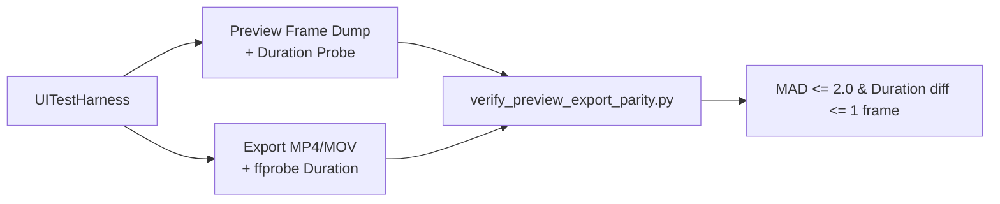

# MovieCut 검증 기준 및 SLO 표준 (Verification & SLO Standards)

> **버전:** 1.1 (2026-08-22 — E/U/P/X/D/S 상태 체계·파리티 3등급 정의·성능 수치 정의·주장 수위 사다리 추가)  
> **목적:** MovieCut의 렌더링 정확성, 파리티, 성능, 안정성을 강제하는 측정 가능한 단일 검증 표준입니다.

---

## 1. 핵심 검증 철학 (Verification Disciplines)

1. **"코드 존재는 완료 증거가 아니다"**:
   * 진정한 기능 완료(DoD)는 **"프리뷰(Preview)에서 보이고, 내보내기(Export) 결과물에 정확히 반영되며, 자동화 검증 산출물(로그, 해시, 캡처, ffprobe)로 입증됨"**을 의미합니다.
2. **문자열 단순 존재 검사(StaticContract) 금지**:
   * 소스 파일 내 문자열 매칭 방식의 테스트는 실제 런타임 동작을 보장하지 못합니다. 모든 검증은 **동작 단위 테스트(Unit/Behavioral Test), 골든 픽셀(Golden Pixel), XCUITest, E2E 실행 스크립트**로 수행합니다.
3. **자가보고 수치 배제**:
   * 모든 벤치마크/SLO 수치는 실제 호스트에서 직접 실행한 측정 명령의 출력값이어야 합니다.
4. **완료 판정은 6단계 상태로만 한다 (2026-08-22)**:
   * **E**ngine 구현 → **U**I 노출 → **P**review 검증 → e**X**port 검증 → **D**evice(실기기) 검증 → **S**hip(출시 지원 범위).
   * UI 미노출 기능은 사용자 관점에서 미구현이며, export 미검증 기능은 출시 기능으로 계상하지 않는다. 경쟁 비교·마케팅 주장에는 **S만** "지원"으로 표기한다. 현재 상태 원장: `COMPETITIVE_ANALYSIS_20260822.md` Part 10.

---

## 2. 렌더링 파리티 판정 기준 (Rendering Parity Benchmark)

프리뷰(`PlaybackEngine`)와 내보내기(`ExportEngine`) 간의 렌더링 일치성은 `scripts/run_core_editing_parity.sh`를 통해 검증합니다.

> **파리티의 등급 정의·수치 확정(2026-08-22 정의, 2026-08-23 CA-02로 수치 확정 — Q7 결정 이행)** — "완전히 같은 픽셀"은 측정 불가능한 주장이므로 3등급으로 판정한다:
> ① **Exact**(시간 계산·키프레임 평가·transform·렌더 계획·무손실 중간 출력): **수치 동일** — 기존 유닛테스트(시간 매핑·키프레임 평가·transform)가 이 등급의 판정을 담당한다.
> ② **Tolerance**(GPU 색보정·마스크 경계·필터 출력): **프레임당 채널 MAD ≤ 2.0(0~255 기준) + 길이 오차 ≤ 1프레임** — 아래 17개 파리티 시나리오 전부가 이 등급의 판정 게이트다(현행 전 시나리오 이 기준으로 재판정 완료 상태).
> ③ **Perceptual**(최종 코덱 인코딩·프록시 프리뷰·HDR 디스플레이): **블라인드 비교 비열등**(방향 문서 §3 4단계 게이트 기준) + 참조 지표(PSNR/SSIM·프레임별 최대 오차)를 조건 필드와 함께 기록한다.
> 외부 문구는 "보이는 대로 출력"을 사용한다. 골든 재판정 기준: 신규 시나리오는 작성 시 소속 등급을 표에 명시하고, Tolerance 시나리오의 허용치 변경은 별도 승인 없이 불가하다.



### 2.1 판정 기준 (Acceptance Criteria)
* **시각 오차 (MAD - Mean Absolute Difference)**:
  * 픽셀 채널당 평균 절대 오차 **MAD ≤ 2.0** (0~255 기준)
  * 인코딩/스케일링에 따른 플랫폼 허용 오차는 인정하되, 렌더링 불일치는 엄격히 차단
* **합성 재생 길이 (Duration)**:
  * Preview 합성 길이와 Export 파일 길이의 오차가 **프로젝트 1프레임(1 / frameRate) 이내**여야 함 (30fps 기준 ≤ 0.033초)

### 2.2 표준 파리티 16개 시나리오
| # | 시나리오 | 검증 내용 | 기준 MAD |
|---|---|---|---|
| 1 | `split_2x` | 클립 2분할 후 렌더링 연속성 | ≤ 2.0 |
| 2 | `speed_ramp` | 속도 곡선 적용 구간의 프레임 시간 매핑 | ≤ 2.0 |
| 3 | `text_overlay` | 텍스트/자막 렌더링 및 폰트 래스터라이징 | ≤ 2.0 |
| 4 | `bgm` | 오디오 트랙 믹싱 및 재생 길이 일치 | ≤ 2.0 |
| 5 | `filter_mask_subtitle` | 마스크 + 컬러 필터 + 자막 복합 합성 | ≤ 2.0 |
| 6 | `image_video_mixed` | 스틸 이미지와 비디오 클립 혼합 재생 | ≤ 2.0 |
| 7 | `normal_delete` | 클립 삭제 후 갭(빈 공간) 유지 렌더링 | ≤ 2.0 |
| 8 | `ripple_delete` | 클립 삭제 후 후속 클립 전진(갭 폐쇄) | ≤ 2.0 |
| 9 | `trim_end` | 클립 끝부분 트림 조작 | ≤ 2.0 |
| 10 | `move_clip` | 클립 타임라인 위치 이동 | ≤ 2.0 |
| 11 | `reverse_playback` | 역재생 프레임 역순 렌더링 | ≤ 2.0 |
| 12 | `freeze_frame` | 특정 프레임 정지 구간 렌더링 | ≤ 2.0 |
| 13 | `crop_rect` | G-23 크롭 픽셀 경로(이미지 소스)의 프리뷰↔출력 동일성 | ≤ 2.0 |
| 14 | `crop_rect_video` | 미태그 BT.601 SD 비디오 소스의 컴포지터 색공간 계약(2026-08-17 수정의 회귀 트립와이어 — 크롭 후 캔버스를 채우는 비디오 소스로, 색조 회전이 레터박스·마스킹·색 crush 뒤에 숨을 수 없음) | ≤ 2.0 |
| 15 | `hsl_curves` | G-02 Inc5 HSL 밴드 큐브 렌더 체인의 프리뷰↔출력 동일성(레드 밴드 탈포화+마스터 커브 — 밴드 편집 UI가 커밋하는 값의 실증) | ≤ 2.0 |
| 16 | `karaoke_text` | G-01 Inc2 카라오케 활성 단어 하이라이트의 프리뷰↔출력 동일성(단어 시작 전/후 하이라이트 상태 각각 샘플) | ≤ 2.0 |
| 17 | `motion_tracking` | 모션 트래킹 적용 구간의 프리뷰↔출력 동일성(2026-08-22 문서 정합성 검토에서 표에 누락된 것을 보강 — 스크립트 314행 활성 시나리오) | ≤ 2.0 |

> 번호 주석: 표의 #는 위 표 기준. `run_core_editing_parity.sh` 내 시나리오 번호는 전환(transition) 시나리오 1번이 주석 처리되어 있어 +1 차이난다(#13 `crop_rect` = 스크립트 14번, #14 `crop_rect_video` = 스크립트 15번, #15 `hsl_curves` = 스크립트 16번, #16 `karaoke_text` = 스크립트 17번).

---

## 3. 골든 픽셀 및 시각 회귀 테스트 (Golden Pixel Tests)

* **원칙**: CoreImage 픽셀 프로세서는 `GoldenPixel.assertRendererFunctional()`을 최상단에서 실행하여 소프트웨어 렌더러가 정상 작동함을 선행 검증합니다.
* **허용 오차**: 소프트웨어 렌더러 픽셀 비교 시 채널당 허용 오차 2 이내 유지.
* **UI 레이아웃 골든 캡처**: `scripts/ui_regression.sh`를 통해 Inspector, Timeline, Library 패널의 dHash 골든 스크린샷 비교를 수행합니다.

---

## 4. 성능 SLO (Service Level Objectives)

[`docs/PERFORMANCE_SLO.md`](file:///Users/cool-mini4/MyDev/automation/movie_cut/docs/PERFORMANCE_SLO.md)에 정의된 실측 기준선 및 목표:

| 지표 | v1 목표치 | 현재 측정치 (Apple Silicon 기준) | 강제 게이트 |
|---|---|---|---|
| **메모리 피크** | 4 GB 미만 | 4K Debug 237 MB / Release 225 MB | `scripts/perf_4k.sh` (`MEM_LIMIT_BYTES=4GB`) |
| **4K Export 실시간 배수** | Release ≤ 1.2× / Debug ≤ 1.5× | Release 0.99× / Debug 0.92× | `scripts/perf_release.sh`, `scripts/perf_4k.sh` |
| **1080p 프리뷰 렌더** | 60 fps 유지 (≤ 16.6ms) | 5.51 ms/frame (182 fps 상당) | Signpost `playback.buildComposition` |
| **4K 프리뷰 과열 방어** | 드롭률 < 5% / 자동 강등 | `.fair` 시 1/2 해상도 클램프 → `.serious` 시 720p 프록시 | `ThermalProxyDowngradeTests` |
| **타임라인 Seek 응답** | 중앙값 100 ms 이하 | Instruments Signpost 계측 | Signpost `playback.seek` |
| **프로젝트 열기 (10분 영상)** | 3.0초 이하 | Instruments Signpost 계측 | Signpost `import.openProject` |
| **자동 저장 복구** | 크래시 후 즉시 복구 | `recovery.moviecut` 완전 복원 | `scripts/run_recovery_gate.sh` |

> **성능 수치의 측정 정의(2026-08-22)** — 대외 공개·비교 시 필수:
> * **RTF(Real-Time Factor) = export 경과 시간 / 출력 길이.** "0.99×" = 10분 영상을 9분 54초에 출력. 모든 비교에는 조건 필드를 첨부한다(기기·OS·앱버전·전원·thermal·cold/warm·저장장치·코덱·해상도·비트레이트·HW 인코딩·반복 횟수·중앙값/p95·peak RSS·앱 전체 vs encode 구간).
> * **seek**: 현행 signpost p50 0.05ms는 **타임라인 모델 계산 시간**이다. 외부 공개 값은 "사용자 입력 → 화면 프레임 표시 완료"(모델 계산/디코더 seek/첫 프레임/표시 완료/연속 scrubbing으로 분해 측정)로 재정의한다.

---

## 5. 자동화 게이트 체계 (Gate Pipeline)

모든 코드 변경은 다음 5단계 게이트([`scripts/verify_gate.sh`](file:///Users/cool-mini4/MyDev/automation/movie_cut/scripts/verify_gate.sh))를 통과해야 합니다:

```bash
bash scripts/verify_gate.sh
```

1. **Step 1**: `swift build` (Core 라이브러리 및 Swift 컴파일 통과)
2. **Step 2**: `swift test` (전체 유닛/통합·골든 전수 테스트 100% 통과 — 2026-08-21 기준 1,345개)
3. **Step 3**: `xcodebuild -scheme MovieCutMac` (macOS 샌드박스 앱 빌드 성공)
4. **Step 4**: `xcodebuild -scheme MovieCutiOS` (iOS 앱 빌드 성공)
5. **Step 5**: iOS generic device 빌드(`CODE_SIGNING_ALLOWED=NO`) — iOS 스킴 장기 미빌드 사고(2026-08-14 이전 2주) 재발 방지 게이트

---

## 6. 검증 방법론 업그레이드 (2026-08-15, 외부 검수 채택)

> 근거: `docs/DEVELOPMENT_DIRECTION_20260815.md` §5. 기존 체계는 **일관성**에는 강하지만 **외부 정합성**을 보장하지 않는 등 5개 맹점이 확인되어 아래 축을 추가한다. 신규 기능(G-23~G-29)의 DoD부터 단계적으로 적용하며, 기존 시나리오는 게이트 강화 증분에서 보강한다.

### 6.1 외부 정합성 축 (프리뷰=출력은 "정답"이 아님)
동일 렌더러의 같은 버그는 두 결과를 완벽히 일치시킨다. 따라서 패리티 외에 다음을 추가한다:
- 수학적으로 생성한 reference frame과의 비교 (색 변환 표준값 포함)
- 독립 구현(예: ffmpeg filter 경로)과의 대조
- 코덱 디코딩 후 결과 비교 (인코딩을 거친 최종 파일 기준)

### 6.2 평균 MAE 보완 (국소 결함은 평균에 숨는다)
MAD ≤ 2.0은 화면 일부의 큰 오류, 자막 가장자리 손상, 알파 halo, 1프레임 플래시, temporal flicker를 숨길 수 있다. 신규 시나리오에는 병행 표기한다:
- p95·p99·최대 오차 / 오류 픽셀 비율(임계 초과 픽셀 수) / 영역별 MAE
- SSIM, 색상 패치 ΔE, temporal difference, 알파 경계 전용 검사
- VMAF는 **인코딩 품질 회귀 보조 지표로만** 사용 (그레이딩·스태빌 성공 지표로 오용 금지)

### 6.3 누적 드리프트 검사 (1프레임 허용이 장기 드리프트를 숨긴다)
분당 PTS 정합, 오디오 샘플 위치, 30/60/120분 종료점 검사. 필수 케이스: VFR 소스, mixed frame rate, 혼합 sample rate, speed ramp, reverse, compound clip, 프록시→원본 교체.

### 6.4 AI 기능 지표 보완 (평균은 실패를 숨긴다)
광학플로우/트래킹/NR/스템류 기능에는 평균값 외에 하위 5%(p5)·실패율, 가림 후 재획득, 장면 전환 초기화, 아티팩트 유형 라벨, confidence·fallback 정확도, 블라인드 사용자 선호를 추가한다.

### 6.5 UX 측정 신설 (스크린샷 회귀는 조작성을 측정하지 않는다)
대표 작업(W1~W5) 기준: 기능 발견률, 첫 성공까지 시간, 오조작 수, undo 사용 횟수, 패널 왕복, 키보드 완결성, VoiceOver. 완료 기준에 접근성 항목을 포함한다.

### 6.6 벤치마크 고정 (움직이는 목표 방지)
CapCut·FCP 비교는 **분기별 버전 고정 + 비교 횟수·범위 선언**으로만 수행한다. 경쟁 제품 출력물 보관·평가는 권리 확인 후 진행.

### 6.7 경쟁 주장의 수위 관리 (2026-08-22)
경쟁 우위 주장은 3단계 사다리로만 승격한다 — ① 현재: "온디바이스 다국어 자막에 집중" ② 실증 후: "계정 없이 긴 영상 자막 생성" ③ 블라인드 평가 후: "주요 언어에서 경쟁 대비 동급 이상". 경쟁 사실의 출처·신뢰도·검증 상태는 `COMPETITIVE_ANALYSIS_20260822.md` Part 9(증거 원장)에서만 관리하며, 신뢰도 미표기 인용을 금지한다. 정량 비교(PSNR/SSIM·시간)는 §6.6 고정 버전 + 블라인드 비교 병행 시에만 가능하다.
